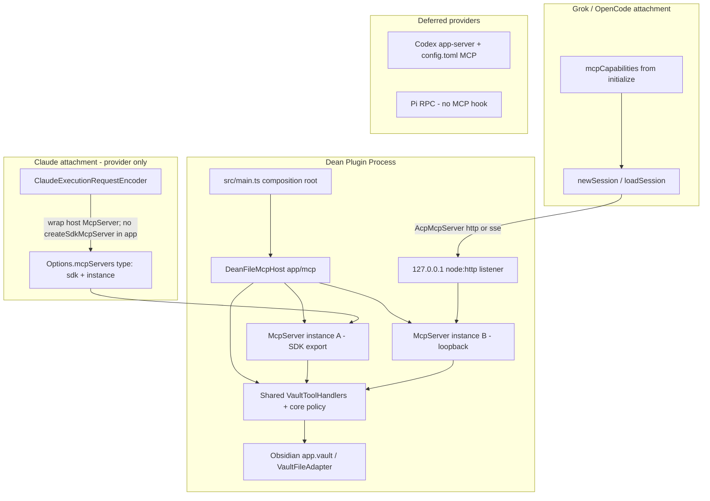
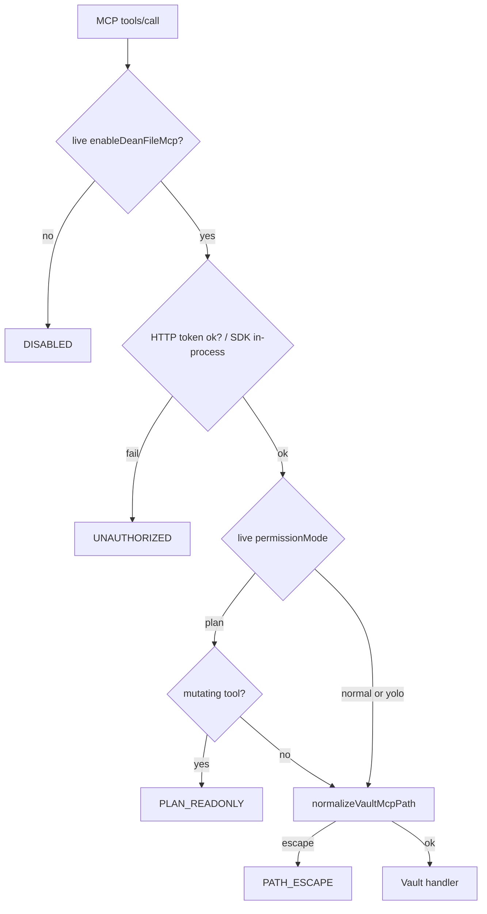

# Dean File MCP — Design Document

| Field | Value |
| --- | --- |
| **Title** | Dean File MCP for programmatic vault/file interaction |
| **Author** | TBD |
| **Date** | 2026-08-17 |
| **Status** | Draft (rev 2 — review feedback incorporated) |
| **Related** | `docs/superpowers/specs/2026-08-17-editor-session-sections-design.md` (MCP deferred in v1); `docs/providers.md`; `docs/architecture.md` |

---

## Overview

Dean agents interact with vault files primarily through **provider-native tools** (Write / Edit / Read / Grep / Glob and provider-local equivalents). Those tools are process/CLI-scoped, uneven across providers, free-form in path semantics, and only weakly Obsidian-aware (no structured frontmatter, no active-note/selection contract, no vault-relative path policy owned by Dean).

This design introduces a **Dean-owned MCP server** (“Dean File MCP”, wire name `dean-vault`) that exposes a small, versioned set of **vault-aware tools** with structured JSON results. The hard problem deferred by the editor session-sections design — **how Dean actually attaches a host MCP to provider runtimes** — is solved with a dual attachment strategy:

1. **Claude**: in-process MCP via a host-exported `@modelcontextprotocol/sdk` `McpServer` instance, wrapped **only in the Claude provider** as `{ type: 'sdk'; name: 'dean-vault'; instance }` on `Options.mcpServers`. No file-based `.claude/mcp.json`. **`createSdkMcpServer` is not used in `app/` or `core/`.**
2. **Grok / OpenCode (ACP)**: loopback HTTP or SSE MCP on `127.0.0.1` with a bearer token, selected from negotiated `agentCapabilities.mcpCapabilities`, registered on `session/new` and `session/load` as `mcpServers` instead of today’s hard-coded `[]`.
3. **Codex / Pi**: no reliable host-injection path in Dean today; **out of v1 attachment**, documented as gaps with optional follow-ups.

The MCP runtime is owned by the **application composition root**, tool policy and path containment live in **core contracts**, and each provider only adapts attachment at its existing session/options boundary. This preserves architecture directions: core stays provider-neutral; features do not import providers; providers do not own vault semantics; `app/` does not import `@anthropic-ai/claude-agent-sdk`.

---

## Background & Motivation

### Current state (verified in tree)

| Area | Reality in codebase |
| --- | --- |
| MCP SDK dependency | `@modelcontextprotocol/sdk` ~1.30.0 is in `package.json` and path-mapped in `tsconfig.json`, but **unused for host injection**. |
| Claude MCP | Documented as CLI-owned (`src/providers/claude/AGENTS.md`, `docs/providers.md`). Composition root calls `deleteLegacyMcpConfig` to remove `.claude/mcp.json` at storage init (`src/main.ts` → `src/providers/claude/storage/LegacyMcpConfigCleanup.ts`). Integration test: `tests/integration/main.test.ts` “deletes the legacy Claude MCP configuration”. |
| Claude SDK options | `ClaudeExecutionRequestEncoder` builds `Options` without `mcpServers` (tests assert `mcpServers` is `undefined`). The real SDK (`@anthropic-ai/claude-agent-sdk` `sdk.d.ts`) supports `mcpServers?: Record<string, McpServerConfig>`, including **`McpSdkServerConfigWithInstance`** (`{ type: 'sdk'; name; instance: McpServer }` from the MCP package) and helper `createSdkMcpServer()` (Claude-provider-only; **not** used by the Dean host). Query also has `setMcpServers()`. |
| ACP (Grok / OpenCode) | `AcpNewSessionRequest` / `AcpLoadSessionRequest` require `mcpServers: AcpMcpServer[]` with `stdio` \| `http` \| `sse` variants (`src/providers/acp/types.ts`). Grok and OpenCode always pass `mcpServers: []` (`GrokExecutionSession.ts`, `OpencodeAcpSessionKernel.ts`). |
| ACP MCP capabilities | `AcpMcpCapabilities { http?: boolean; sse?: boolean }` on `AcpAgentCapabilities.mcpCapabilities`. `AcpClientConnection.initialize()` stores `negotiatedAgentCapabilities`. Grok/OpenCode initialize **before** `session/new\|load`. **Not used today for attachment.** |
| Codex | Observes and normalizes `mcpToolCall` / history `mcp_tool_call` as `mcp__{server}__{tool}`. Settings UI points users at `codex mcp` / native config (`NativeMcpSettingsSection`). App-server public surface includes `config/mcpServer/reload` and `mcpServerStatus/list` (external docs); Dean does **not** inject MCP into `thread/*` requests. |
| Pi | No MCP symbols under `src/providers/pi/`. Launch is `pi --mode rpc` with native tool flags only (`PiLaunchSpec.ts`). |
| Settings UX | Shared `renderNativeMcpSettingsSection` tells users to configure MCP on each provider CLI. |
| Settings fail-closed | Host booleans such as `enableEditorSessionSections` use dedicated normalizers in `DeanSettingsStorage` (`typeof value === 'boolean' ? value : false`) because `DeanSettings` is spread-merged from untrusted JSON. |
| Vault I/O in Dean | `VaultFileAdapter` wraps Obsidian adapter with managed-path verification; `pathContainment.isPathWithinRoot` is fail-closed. **`normalizePathForVault` is not fail-closed alone** — when a path is outside the vault it returns the normalized raw path rather than `null`/`PATH_ESCAPE` (`src/utils/path.ts`). Session section write-back uses `app.vault`. |
| Permission model | Shared `PermissionMode = 'yolo' \| 'plan' \| 'normal'`. Claude maps via `ClaudeExecutionRequestEncoder.resolveSdkPermissionMode` and `ClaudeInteractionHandler.canUseTool`. `ProviderToolPolicy` kinds include `passive`, `read-only`, `provider-default`, `unrestricted`, `allow-list`. File-tool approval helpers live in `src/core/security/approvalRules.ts`. |
| Permission storage | `permissionMode` is **settings-projected** (global / provider-projection maps), not per-conversation durable state. Multi-tab shares the projected mode by product design. |
| Chat rendering | Write/Edit use `WriteEditRenderer`; generic MCP tools render via `mcp__…` naming and `isMcpTool` / MCP icons. |
| Bundle | `esbuild.config.mjs` bundles dependencies into `main.js` (~3.2MB class); only Obsidian/CodeMirror/Node builtins are external. MCP SDK HTTP helpers can pull Express/Hono stacks. |
| Prior design rejection | Session-sections design (D5) rejected Dean MCP in v1 because there was no shared host-MCP injection point. This document is that injection design. |

### Pain points

1. **Uneven vault semantics** — providers disagree on path shape (absolute vs cwd-relative), edit APIs, and metadata.
2. **No Obsidian-aware surface** — agents cannot reliably read frontmatter as structured data, query the active note/selection, or open a note in the workspace without shell hacks.
3. **CLI-owned MCP is opaque** — users configure MCP outside Dean; Dean cannot guarantee a vault-safe server is present, nor apply Dean permission modes to its tools.
4. **Security** — free-form Write/Bash can escape intent; a Dean-owned tool layer can fail closed on path escape using existing containment primitives.

---

## Goals & Non-Goals

### Goals

1. Ship a **Dean-owned MCP server** with a concrete **phased** tool set for vault-aware structured ops and basic editor context.
2. **Actually attach** that server to provider runtimes that have a real injection hook (Claude + ACP).
3. Keep attachment **behind a settings flag** (default off), **fail-closed boolean normalization**, merge-safe settings, and independently reviewable PRs.
4. Enforce **vault-relative paths**, path containment, and plan-mode read-only policy inside Dean tool handlers (fail closed), with **call-time** mode binding.
5. Return **structured JSON** results (plus human-readable MCP text content for clients that only surface text).
6. Preserve architecture directions and provider non-parity honesty; keep Claude Agent SDK imports inside `src/providers/claude/`.
7. Gate loopback transport on **measured bundle size** and negotiated ACP `mcpCapabilities`.

### Non-Goals (v1)

1. Replacing provider-native Read/Write/Edit/Bash tooling.
2. Host injection for **Codex** or **Pi** (document only; optional later).
3. Writing or resurrecting `.claude/mcp.json` as the Claude attachment mechanism.
4. User-configurable arbitrary host MCP catalogs inside Dean (third-party MCP remains CLI-owned).
5. Mutating provider-native history/transcripts when vault tools run.
6. Remote/network-exposed MCP (loopback only when HTTP is used).
7. Full note-graph / dataview / plugin API exposure.
8. Using MCP as the primary authoring path for editor session sections (that remains Write/Edit + prompt appendix unless a later revision chooses otherwise).
9. **v1.0 tools** do not include `vault_glob` / `vault_search` / `vault_read_range` (fast-follow after attachment is proven).

---

## Key Decisions

| ID | Decision | Rationale |
| --- | --- | --- |
| **K1** | Product name: **Dean File MCP**; wire server name: `dean-vault`. | Stable tool prefix `mcp__dean-vault__*` across Claude/Codex-style naming without colliding with user CLI MCP names. |
| **K2** | **Application-owned host** (`src/app/mcp/`), **core contracts + path policy** (`src/core/mcp/`), **provider-local attachment only**. | Matches dependency direction: providers must not own vault semantics; features must not import provider runtimes; core must not import app composition. |
| **K3** | **Dual transport with dual `McpServer` instances** over **shared pure handlers**: (a) Claude-facing in-process `McpServer` export; (b) loopback HTTP/SSE `McpServer` + Node listener. See [Dual-instance lifecycle](#dual-instance-lifecycle-k3--k10). | MCP `McpServer.connect(transport)` owns a single transport. One instance cannot safely serve both SDK-local dispatch and Streamable HTTP. Shared handlers keep vault semantics single-sourced. |
| **K3a** | Host builds tools **only** with `@modelcontextprotocol/sdk` `McpServer` / `registerTool`. Claude adapter alone maps host-exported `McpServer` → `{ type: 'sdk'; name: 'dean-vault'; instance }`. **Never call `createSdkMcpServer` from `app/` or `core/`.** | Preserves “only `src/providers/claude/**` imports claude-agent-sdk.” |
| **K4** | **Do not use `.claude/mcp.json`**. Keep deleting the legacy path at storage init. Claude injection is **only** via SDK `Options.mcpServers` (and optional live `setMcpServers` on restart). | Aligns with `claude/AGENTS.md` (update that doc when attachment lands); avoids banned write path. |
| **K5** | **v1 providers**: Claude + Grok + OpenCode. **Deferred**: Codex, Pi. | Injection hooks exist for the first three; Codex is config-file/CLI managed; Pi has no MCP surface in Dean. |
| **K6** | **Feature flag** `enableDeanFileMcp: boolean` default `false`, with **`normalizeEnableDeanFileMcp`** (boolean-only; else false). | Mirrors `normalizeEnableEditorSessionSections` / session-sections D14; untrusted JSON fail-closed. |
| **K7** | Tool handlers use **Obsidian vault APIs** (`app.vault` / adapter), not raw CLI cwd writes, for Dean MCP paths. | Index consistency and path policy shared with Collect write-back. |
| **K8** | **Two-layer permissions**: (1) provider-native gates; (2) Dean handler matrix with **call-time** `settings.permissionMode` (plan → read-only; normal → allow at handler + trust/verify provider permission UX; yolo → allow non-escape writes). | MCP must not bypass plan mode or path containment; shared host cannot freeze mode at encode time only. |
| **K9** | MCP tools are **additive**, not a disallow of native file tools. | Avoid tool-policy fights in v1. |
| **K10** | Host runtime is **plugin-scoped** (one listener, one token epoch, shared handler module); MCP **protocol instances** are dual (K3). Multi-tab Claude queries may share the Claude-facing `McpServer` instance; dispose rules below. | Avoid N HTTP listeners; keep token rotation simple. |
| **K11** | Restart keys / ACP session rebuild fingerprints must include host-MCP attachment identity (flag, catalog version, server name, permission **class**, toolPolicy attachment class, ACP transport + capability fingerprint, token **epoch**—not raw secrets). | Stale sessions must not keep an old allowlist or missing server after toggle. |
| **K12** | ACP transport selection uses **`negotiatedAgentCapabilities.mcpCapabilities`**: prefer `http` if true, else `sse` if true, else **do not attach** and surface settings status error. | Capabilities already modeled; do not guess via open-ended traces alone. |
| **K13** | Path authorization uses dedicated `normalizeVaultMcpPath` + `pathContainment` / realpath checks. **Do not** use `normalizePathForVault` alone for MCP auth. | `normalizePathForVault` returns out-of-vault normalized strings. |
| **K14** | v1.0 tool set is minimal (stat/read/write/edit/list/context + optional frontmatter). Glob/search/range are **v1.1 fast-follow**. | Prove attachment before expanding DoS surface. |

---

## Proposed Design

### High-level architecture



### Dual-instance lifecycle (K3 + K10)

MCP TypeScript `McpServer.connect(transport)` **assumes ownership of a single transport**. Claude’s `McpSdkServerConfigWithInstance` holds a live `McpServer` for **SDK-local** dispatch (not necessarily the same connect path as HTTP). Streamable HTTP/SSE needs a connected Node transport. Therefore:

| Piece | Multiplicity | Notes |
| --- | --- | --- |
| Handler functions + path/mode gates | **One shared module** | Pure registration of the same tool implementations |
| `McpServer` instance **A** (Claude) | **One** while flag enabled | Created by host via `@modelcontextprotocol/sdk` only; **never** `connect()`’d to HTTP. Exported to Claude adapter as `instance`. |
| `McpServer` instance **B** (ACP) | **One** while flag enabled and loopback running | `connect()`’d to the loopback transport only |
| Loopback listener | **One** on `127.0.0.1:ephemeral` | Started when flag true **and** at least one ACP consumer may need it (or always when flag true if simpler—prefer start-on-flag for predictability) |
| Bearer token epoch | **One** per host start | Rotate on stop/start and flag toggle |

**Concurrency**

- Multiple Claude tabs / persistent queries may share instance **A**. Tool handlers must be **re-entrant** and serialize **writes per vault path** (queue), matching `VaultFileAdapter` write-queue spirit.
- Concurrent ACP HTTP tool calls share instance **B** and the same path write queue.
- Handler call-time mode reads **live** `settings.permissionMode` (see [Call-time permission binding](#call-time-permission-and-toolpolicy-binding)).

**Dispose**

1. Flag off or plugin unload: stop listener; close instance B transport; drop token; dispose A and B; subsequent `getHostMcpServers` returns `[]`.
2. Token epoch bump (restart host): all ACP sessions with old fingerprints must rebuild (K11). Claude restartKey changes force query restart.
3. Do **not** call `connect()` twice on the same `McpServer`. Prefer dispose + recreate over reconnect.

### Component ownership

| Component | Location | Owns |
| --- | --- | --- |
| `DeanFileMcpHost` | `src/app/mcp/DeanFileMcpHost.ts` | Start/stop, token mint/epoch, dual `McpServer` instances, loopback bind, status snapshot, `getHostMcpServers` implementation backing |
| Shared handlers | `src/app/mcp/tools/*` | Obsidian-backed implementations; register onto any `McpServer` |
| `createDeanVaultMcpServer()` | `src/app/mcp/createDeanVaultMcpServer.ts` | Factory that builds a **new** `@modelcontextprotocol/sdk` `McpServer` and registers shared tools — **no Claude SDK imports** |
| Path/mode contracts | `src/core/mcp/*` | `normalizeVaultMcpPath`, catalog metadata, pure permission gate, error codes |
| Provider attachment | `src/providers/{claude,grok,opencode}/…` | Mapping host descriptor → SDK options or ACP `mcpServers`; Claude-only instance wrap |
| Settings UX | `src/features/settings` + shared widget | Flag toggle, status, provider coverage, capability errors |
| Chat rendering | `src/features/chat/rendering` (incremental) | Optional nicer blocks for `mcp__dean-vault__*` |

`ProviderHost` gains a narrow capability so providers never import `DeanFileMcpHost` concretely:

```ts
// Proposed addition — src/core/providers/ProviderHost.ts (or adjacent core contract)
export interface HostMcpAttachmentContext {
  readonly providerId: ProviderId;
  readonly vaultWorkingDirectory: string;
  /**
   * Encode-time snapshot for attach/omit decisions and fingerprints.
   * Handler enforcement still re-reads live settings at call time (K8).
   */
  readonly permissionMode: PermissionMode;
  readonly toolPolicy: ProviderToolPolicy;
  /**
   * ACP only: negotiated agent capabilities from initialize.
   * Claude omits this.
   */
  readonly acpMcpCapabilities?: { http?: boolean; sse?: boolean } | null;
}

export type HostMcpServerDescriptor =
  | {
      readonly transport: 'sdk-instance';
      readonly name: string; // 'dean-vault'
      /**
       * Live `@modelcontextprotocol/sdk` McpServer.
       * Claude adapter alone wraps as McpSdkServerConfigWithInstance.
       * Typed as unknown at the ProviderHost boundary to avoid core→mcp-sdk coupling
       * if preferred; app implementation may use a branded type instead.
       */
      readonly mcpServer: unknown;
    }
  | {
      readonly transport: 'http' | 'sse';
      readonly name: string;
      readonly url: string;
      readonly headers: ReadonlyArray<{ name: string; value: string }>;
    };

export interface ProviderHost {
  // existing members…
  /**
   * Returns Dean-owned MCP servers to attach for this execution, or [].
   * Empty when disabled, non-attachable toolPolicy, unsupported provider,
   * or ACP with neither http nor sse capability.
   */
  getHostMcpServers?(context: HostMcpAttachmentContext): HostMcpServerDescriptor[];

  /**
   * Stable non-secret fingerprint for restart/session rebuild keys.
   * Includes flag, catalog version, server name, permission class,
   * toolPolicy attachment class, acp transport choice, token epoch.
   */
  getHostMcpAttachmentFingerprint?(context: HostMcpAttachmentContext): string;
}
```

`DeanProviderHost` implements these by delegating to `DeanFileMcpHost`.

### Attach / omit algorithm

```text
function shouldAttachHostMcp(ctx): boolean {
  if (!normalizeEnableDeanFileMcp(settings.enableDeanFileMcp)) return false;
  if (!host.isRunning()) return false;
  switch (ctx.toolPolicy.kind) {
    case 'passive':
    case 'read-only':
      return false;
    case 'allow-list':
      // v1: never attach host MCP for allow-list executions.
      // Native allow-lists rarely include mcp__dean-vault__* names;
      // attaching would expose tools the policy cannot express cleanly.
      return false;
    case 'provider-default':
    case 'unrestricted':
      break;
    default:
      return false; // fail closed on unknown kinds
  }
  if (ctx.providerId === 'claude') return true;
  if (ctx.providerId === 'grok' || ctx.providerId === 'opencode') {
    const caps = ctx.acpMcpCapabilities;
    return Boolean(caps?.http || caps?.sse);
  }
  return false; // codex, pi, unknown
}

function selectAcpTransport(caps): 'http' | 'sse' | null {
  if (caps?.http) return 'http';
  if (caps?.sse) return 'sse';
  return null;
}
```

When ACP attach is desired but `selectAcpTransport` is `null`, return `[]` **and** set host status to an error such as `ACP agent did not advertise MCP http/sse capabilities` (visible in settings; not a silent-only empty array).

### Transport design (the hard problem)

#### Claude — in-process MCP (v1)

**Layering (critical):**

| Layer | Allowed |
| --- | --- |
| `src/app/mcp` | `@modelcontextprotocol/sdk` `McpServer`, `registerTool`, shared handlers |
| `src/providers/claude` | Import host descriptor; build `{ type: 'sdk', name: 'dean-vault', instance: descriptor.mcpServer as McpServer }` for `Options.mcpServers`. May use Claude SDK types. **May not** require app to call `createSdkMcpServer`. |
| `src/core` | No MCP SDK server construction; pure policy only |

**Attachment point:** `ClaudeExecutionRequestEncoder.encode` when building `options` (`ClaudeExecutionRequestEncoder.ts`).

```ts
// Conceptual — Claude adapter only (providers/claude)
const ctx = {
  providerId: 'claude' as const,
  vaultWorkingDirectory: sessionConfig.vaultWorkingDirectory,
  permissionMode: settings.permissionMode,
  toolPolicy: request.toolPolicy,
};
const hostServers = this.deps.host.getHostMcpServers?.(ctx) ?? [];
const mcpServers: Record<string, McpServerConfig> = {};
for (const server of hostServers) {
  if (server.transport === 'sdk-instance') {
    mcpServers[server.name] = {
      type: 'sdk',
      name: server.name,
      instance: server.mcpServer as McpServer, // from @modelcontextprotocol/sdk
      // Prefer alwaysLoad semantics if the SDK config supports it on this shape;
      // if only createSdkMcpServer options expose alwaysLoad, set equivalent
      // per-tool alwaysLoad / never-defer metadata when registering tools in app
      // so Claude tool-search does not hide dean-vault tools on turn 1.
    };
  }
}
if (Object.keys(mcpServers).length > 0) {
  options.mcpServers = mcpServers;
}
```

**`alwaysLoad` rule (locked for v1):** Dean vault tools must be visible on turn 1 without tool-search deferral. Prefer SDK `alwaysLoad: true` when attaching via a config that supports it; otherwise register tools in `createDeanVaultMcpServer` with MCP tool `_meta` / annotations that the Claude path treats as always-loaded, and **assert in unit tests** that the encoded options (or registered tool meta) include the always-load signal.

**Restart key fields (exact, non-secret):** extend existing `restartKey` JSON with:

```ts
hostMcp: {
  enabled: boolean;           // normalized flag && shouldAttach for this request
  catalogVersion: number;     // DEAN_FILE_MCP_CATALOG_VERSION
  serverName: 'dean-vault';
  permissionClass: 'plan' | 'normal' | 'yolo';
  toolPolicyClass: 'attach' | 'omit'; // attach only for provider-default|unrestricted
  tokenEpoch: number;         // host epoch even for SDK path so flag recycle is uniform
}
```

Do **not** put bearer tokens or raw headers in the key.

#### Grok / OpenCode — ACP `mcpServers` (v1)

Verified request shape (`src/providers/acp/types.ts`): `AcpMcpServer` = `http` | `sse` | `stdio`.

**Capability-based transport (K12):** after `AcpClientConnection.initialize()`, read `negotiatedAgentCapabilities?.mcpCapabilities`. Prefer `http`, else `sse`, else no attach + status error.

**Attachment points:**

- Grok: `GrokExecutionSession` `loadSession` / `newSession` currently pass `mcpServers: []` (~L580, ~L635).
- OpenCode: `OpencodeAcpSessionKernel.openSession` load/new (~L287, ~L302).

```ts
function toAcpMcpServers(descriptors: HostMcpServerDescriptor[]): AcpMcpServer[] {
  return descriptors.flatMap((d) => {
    if (d.transport === 'http' || d.transport === 'sse') {
      return [{
        type: d.transport,
        name: d.name,
        url: d.url,
        headers: [...d.headers],
      }];
    }
    return []; // sdk-instance is Claude-only
  });
}
```

##### Grok session rebuild fingerprint

Today `buildSessionConfigurationKey` is only:

```ts
JSON.stringify({
  systemPromptOverride: meta.systemPromptOverride ?? null,
  yoloMode: meta.yoloMode === true,
});
```

**v1 extension:**

```ts
JSON.stringify({
  systemPromptOverride: meta.systemPromptOverride ?? null,
  yoloMode: meta.yoloMode === true,
  // permission class must rebuild so plan↔normal↔yolo re-sends mcpServers
  // and native mode application stays aligned with Dean handler expectations
  permissionClass: request.configuration.permissionMode
    ?? request.configuration.mode
    ?? 'normal',
  hostMcp: host.getHostMcpAttachmentFingerprint?.(ctx) ?? 'off',
});
```

When the key changes, existing behavior already shuts down and recreates the native session (`GrokExecutionSession` load path) — extend tests to cover host-MCP fingerprint flips.

##### Grok fork path (`_x.ai/session/fork`)

Verified: `createForkSession` calls `native.fork` / `requestGrokSessionFork` with `{ newCwd, newModelId?, sourceCwd, sourceSessionId, targetPromptIndex }` — **no `mcpServers` field** (`GrokExecutionNativeConnection`, `GrokExtensionRequests.ts`).

**Decision:** Fork **inherits agent-side MCP configuration from the parent session** that was established at parent `newSession`/`loadSession`. Dean does **not** re-send MCP on the fork RPC (API has no slot).

**Requirements:**

1. Parent must have been created/loaded with correct `mcpServers` while the flag was on.
2. If the user toggles `enableDeanFileMcp` or token epoch changes **after** fork, the extended `buildSessionConfigurationKey` / host fingerprint must force a **full native recycle** (shutdown + load/new with new `mcpServers`), not rely on fork inheritance of a stale parent set.
3. Unit test: fork after parent newSession with host MCP attached does not throw; optional wire-trace note that child session still exposes dean-vault tools when parent did (document “inherits agent-side MCP set at parent new/load”).

##### OpenCode session rebuild (required; missing today)

`OpencodeAcpSessionKernel.openSession` only load/new with `mcpServers: []` and has **no** configuration-key recycle path comparable to Grok.

**v1 requirement:**

1. Compute `hostMcpFingerprint` (+ permission class + system prompt key already used for launch artifacts) when opening or before turns that may reuse a warm kernel.
2. Store the fingerprint on the kernel/session owner when `openSession` succeeds.
3. When fingerprint **differs** from the stored value (flag/token epoch/catalog/capability transport/permission class change), **dispose and reopen** the ACP session (`loadSession`/`newSession` with current `mcpServers`) before the next prompt. Prefer the same fencing style OpenCode already uses for environment/runtime fingerprint invalidation.
4. Tests mirror Grok: flip `enableDeanFileMcp` or token epoch → next execution re-calls `openSession` with updated `mcpServers`.

#### Loopback HTTP/SSE host

```mermaid
sequenceDiagram
  participant Plugin as DeanFileMcpHost
  participant ACP as Grok/OpenCode agent
  participant Tools as Shared handlers

  Plugin->>Plugin: bind 127.0.0.1:ephemeralPort
  Plugin->>Plugin: mint 32+ byte token; bump epoch
  Note over Plugin: enableDeanFileMcp=true
  ACP->>Plugin: HTTP/SSE tools/call Authorization Bearer
  Plugin->>Plugin: constant-time token compare; Host checks
  Plugin->>Tools: vault_read / vault_write …
  Tools->>Tools: live mode gate + path contain
  Tools-->>ACP: CallToolResult structuredContent + text
```

**Security requirements (mandatory):**

| Control | Spec |
| --- | --- |
| Bind address | `127.0.0.1` only (not `0.0.0.0`, not `::`) |
| Auth token | `crypto.randomBytes(32)` minimum (256-bit); base64url or hex encoding |
| Token compare | Constant-time equality (`crypto.timingSafeEqual` on equal-length buffers); **never** early-return “missing vs wrong” distinction to clients |
| Auth failure | HTTP **401** (or MCP error equivalent) for missing, malformed, or wrong `Authorization`; same body shape |
| Headers on ACP descriptor | `Authorization: Bearer <token>` |
| Host header / rebinding | Reject requests whose `Host` is not `127.0.0.1:<port>` or `localhost:<port>` (case-insensitive host); reject absolute-form URIs to non-loopback targets if applicable |
| Rate limit | Soft limit e.g. **60 requests/minute/token** in addition to max concurrent tool executions (default 4); excess → `429` / tool error `RATE_LIMITED` |
| Lifetime | Start when flag becomes true; stop on unload or flag false; rotate token on each start |
| Port | Ephemeral OS port; URL path chosen to match the minimal transport implementation |
| Persistence | Token **never** written to settings, providerState, transcripts, or system prompt |
| Agent-side visibility | Bearer token **will** appear in ACP agent process memory/config for the session. Acceptable under the local single-user threat model; stated here so implementers do not “fix” it by logging or vault files |
| Logging | No token in logs; no `console.*` in production |

**Bundle / transport implementation (Issue 6 gate):**

`esbuild` bundles deps into `main.js`. Full `@modelcontextprotocol/sdk` Streamable HTTP server entrypoints can pull `express` / `hono` / related stacks and materially grow startup payload.

**PR-3 acceptance criteria (blocking):**

1. Measure `main.js` (or production build artifact) size **before/after** the transport PR.
2. Prefer **minimal import paths**: `server/mcp` + a thin `node:http` JSON-RPC/Streamable wrapper implementing only what ACP clients need.
3. If the SDK transport **must** pull Express/Hono, document the byte delta in the PR description and run `npm run check:performance` (or the repo’s startup budget check). Fail the PR if delta exceeds an agreed budget (initial proposal: **≤ 200 KiB** gzip or **≤ 500 KiB** raw `main.js` increase—adjust with measured baseline in PR).
4. Alternative (A7): implement a **minimal loopback JSON-RPC handler** that speaks MCP tool list/call only, without Express examples.

**Why not stdio sidecar for ACP:** child lacks `App`; packaging a second Node entrypoint in the Obsidian plugin is painful; Windows shims; dual-instance in-process already solves Obsidian access.

#### Codex (deferred)

No first-class in-process MCP injection in Dean’s Codex integration. Later options: manual URL copy, or careful managed config + `config/mcpServer/reload` (separate design). **v1:** no automatic attachment.

#### Pi (deferred)

No MCP surface. Native tools only.

### Tool catalog

Wire server name: `dean-vault`.  
`DEAN_FILE_MCP_CATALOG_VERSION = 1` for v1.0 tools; bump when schemas change incompatibly.

#### v1.0 (ship with attachment)

| Tool | Mutating? | Purpose | Primary args | Result (structured) |
| --- | --- | --- | --- | --- |
| `vault_stat` | no | Existence, type, size, mtime | `path` | `{ path, exists, type?, size?, mtime? }` |
| `vault_read` | no | Full text read with size cap | `path`, optional `maxBytes` | `{ path, content, truncated, encoding }` |
| `vault_list` | no | List folder (non-recursive default; optional recursive with cap) | `path`, `recursive?`, `limit?` | `{ path, files[], folders[] }` |
| `vault_write` | yes | Create/overwrite full file | `path`, `content` | `{ path, bytesWritten, created }` |
| `vault_edit` | yes | Exact string replace | `path`, `oldString`, `newString`, `replaceAll?` | `{ path, replacements }` |
| `vault_get_context` | no | Active/conversation note + optional selection | `includeSelection?` | `{ activeNotePath?, selectionText?, selectionPath?, openFiles? }` |
| `vault_frontmatter_get` | no | Parse YAML frontmatter (optional but small; may ship in v1.0) | `path` | `{ path, frontmatter: object\|null, bodyOffset? }` |

#### v1.1 fast-follow (after Claude + ACP attachment green)

| Tool | Notes |
| --- | --- |
| `vault_read_range` | Line-range reads |
| `vault_glob` | Glob under vault; limit matches |
| `vault_search` | Content search; regex carefully capped |

#### Later (v2+)

`vault_open` / reveal, rename/delete/mkdir, `vault_frontmatter_set`, metadata-cache queries, binary base64 reads.

**Path rules (`normalizeVaultMcpPath`):**

1. Reject empty, NUL, and paths with `\` in the **input relative form** after a single separator-normalize step (accept `\` only by converting to `/` before validation, then re-validate).
2. Reject any segment that is `''`, `'.'`, or `'..'`.
3. Reject Windows drive prefixes and absolute POSIX paths **unless** the absolute path realpath-resolves **inside** the vault root, in which case convert to vault-relative `/` form.
4. Containment: `isPathWithinRoot` / desktop realpath checks from `pathContainment` + `VaultFileAdapter` managed patterns. Symlinks that escape → `PATH_ESCAPE`.
5. **Do not** call `normalizePathForVault` as the authorization function. That helper returns out-of-vault normalized strings (verified `src/utils/path.ts`). It may be used only as a display helper **after** MCP authorization succeeds.
6. Mobile / non-desktop adapters without `getBasePath`: use adapter-relative checks; fail closed if containment cannot be verified for mutating ops (Open Question #6).
7. External context directories are **not** writable via Dean File MCP in v1.

**Size / DoS caps:**

| Cap | Default |
| --- | --- |
| Max read bytes | 1_048_576 (1 MiB) |
| Max write bytes | 1_048_576 |
| Max recursive list entries | 2_000 |
| Max concurrent tool calls per host | 4 (queue beyond) |
| HTTP requests per minute per token | 60 |

### Call-time permission and toolPolicy binding

**Problem:** Attachment context is computed at session/options encode time, but handlers run later on a **shared** host. ACP HTTP requests carry only the bearer token—no conversation id. Concurrent tabs share projected settings mode.

**Single source of truth at call time:**

| Check | Source |
| --- | --- |
| Host enabled | Live normalized `settings.enableDeanFileMcp`; if false → `DISABLED` |
| Token valid (HTTP) | Current host epoch token; fail → `UNAUTHORIZED` |
| Plan / normal / yolo | Live `ProviderHost.settings.permissionMode` (settings-projected; **not** per-conversation storage). Multi-tab shares mode by product design. |
| Path policy | Per-call path args |
| Encode-time toolPolicy omit | Passive / read-only / allow-list never receive `mcpServers` / sdk instance — first line of defense |
| Mid-session mode flip | Fingerprint includes `permissionClass` → Grok rebuild / OpenCode reopen / Claude restartKey → re-attach; handlers still re-read live mode so a brief race fails closed toward current settings |



**Alignment:**

| Dean `permissionMode` | Handler behavior |
| --- | --- |
| `plan` | Only non-mutating tools; mutating → `PLAN_READONLY` |
| `normal` | Mutating allowed at handler; **provider** should still run permission UX if it does for MCP tools — see [ACP permission acceptance tests](#acp-permission-acceptance-tests) |
| `yolo` | Mutating allowed at handler (path checks remain) |

**`toolPolicy` at encode time:**

| Kind | Attach host MCP? |
| --- | --- |
| `provider-default` | Yes (if flag + provider support) |
| `unrestricted` | Yes |
| `passive` | No |
| `read-only` | No |
| `allow-list` | **No** in v1 (K — explicit) |

### ACP permission acceptance tests

Claude has `canUseTool` + SDK plan mode as an outer gate. ACP plan maps to native modes, but **MCP tools may be auto-allowed** by the agent without `session/request_permission`.

**Before locking v1 for Grok/OpenCode**, require wire-trace (or integration harness) evidence stored under `.context/`:

| Case | Required observation |
| --- | --- |
| Plan + `vault_write` | Handler returns `PLAN_READONLY` (pass even if agent auto-invokes) |
| Normal + `vault_write` | Either (a) ACP permission request reaches Dean interaction UI, or (b) agent auto-allows |
| If (b) auto-allow | **Accepted risk for v1** only if documented in settings help: “Some ACP agents may auto-allow MCP tools; Dean still enforces plan/path gates.” Optional follow-up: Dean-owned confirmation modal for mutating dean-vault tools when provider did not ask. |

Open Question #3 is narrowed: default is **handler gates + document auto-allow if observed**, not an unbounded “trust provider UI” without verification.

### Error model

```json
{
  "code": "PATH_ESCAPE" | "PATH_INVALID" | "NOT_FOUND" | "IS_DIRECTORY" | "TOO_LARGE" | "PLAN_READONLY" | "POLICY_DENIED" | "DISABLED" | "UNAUTHORIZED" | "RATE_LIMITED" | "CONFLICT" | "INTERNAL",
  "message": "human readable",
  "path": "notes/foo.md"
}
```

No stack traces to the model.

### Settings

```ts
/** When true, Dean attaches the File MCP server to supported providers. Default false. */
enableDeanFileMcp: boolean;
```

**Normalization (mandatory, same PR as field introduction):**

```ts
// DeanSettingsStorage — mirror normalizeEnableEditorSessionSections
function normalizeEnableDeanFileMcp(value: unknown): boolean {
  return typeof value === 'boolean' ? value : false;
}
```

- Missing, `"yes"`, `1`, `{}` → **false** (fail closed).
- Unit tests required for invalid values.
- Persist rewrite when stored value was non-boolean (same pattern as other normalizers that trigger save).

Settings writers **merge** as today; this flag is top-level host state like `enableEditorSessionSections`.

**UX:** “Dean File MCP” toggle, provider coverage matrix (Claude/Grok/OpenCode auto; Codex/Pi not auto), runtime status (Stopped / Listening / Error including capability failures). Keep native CLI MCP sections for **user** servers; clarify separation.

### Lifecycle (composition root)

1. Construct `DeanFileMcpHost` after storage/settings load.
2. On settings commit where normalized flag flips, start/stop host; fence provider execution transitions so sessions rebuild with new fingerprints.
3. On unload: stop listener, drop tokens, dispose both `McpServer` instances.
4. Continue `deleteLegacyMcpConfig` — **unchanged**.

### System prompt (optional, small)

When enabled and tool policy attaches, optional one-line appendix via existing `buildSystemPrompt` appendices. Suppress for passive/read-only/allow-list.

### Chat / tool display

v1 relies on existing MCP rendering. Optional later WriteEdit-like UX for write/edit tools.

### Interaction with provider-native file tools

Additive (K9). External dirs remain native + `additionalDirectories`. Session sections stay Write/Edit unless a later design changes that.

---

## API / Interface Changes

### New modules (proposed)

```text
src/core/mcp/
  index.ts
  types.ts                 # error codes, catalog version, tool names
  vaultPathPolicy.ts       # normalizeVaultMcpPath — NOT normalizePathForVault alone
  permissionGate.ts        # pure mode × tool → allow|deny
  attachmentPolicy.ts      # shouldAttach from toolPolicy kind (pure)

src/app/mcp/
  DeanFileMcpHost.ts
  createDeanVaultMcpServer.ts  # MCP SDK only — dual instances via double factory call
  loopbackTransport.ts         # minimal node:http; size-gated
  tools/
    vaultReadWrite.ts          # stat/read/write/edit
    vaultList.ts
    vaultContext.ts
    vaultFrontmatter.ts        # optional v1.0
  hostMcpFingerprint.ts

tests/unit/core/mcp/...
tests/unit/app/mcp/...
tests/unit/app/settings/normalizeEnableDeanFileMcp...
tests/integration/mcp/...
```

### Provider touch points

| Provider | Files (expected) | Change |
| --- | --- | --- |
| Claude | `ClaudeExecutionRequestEncoder.ts`, tests, **`src/providers/claude/AGENTS.md`**, restartKey | Pass `mcpServers` with sdk instance wrap |
| Grok | `GrokExecutionSession.ts`, session config key, fork docs/tests, **provider AGENTS / docs** | Non-empty `mcpServers`; capability selection; fingerprint |
| OpenCode | `OpencodeAcpSessionKernel.ts` + session owner rebuild, tests, docs | Same + **dispose/reopen on fingerprint change** |
| Codex / Pi | Settings copy only | “Not auto-attached” |

### Capability flag (optional)

`supportsHostMcpInjection?: boolean` on `ProviderCapabilities` if UI needs it; Claude/Grok/OpenCode `true`; Codex/Pi `false`. Attachment still gated by live flag + algorithm above.

### Settings / i18n

`enableDeanFileMcp` in defaults + **storage normalizer** + settings tab + locales.

---

## Data Model Changes

| Field | Type | Default | Migration |
| --- | --- | --- | --- |
| `enableDeanFileMcp` | `boolean` | `false` | Missing or non-boolean → false via `normalizeEnableDeanFileMcp` |

No new vault MCP config files. Token is ephemeral memory only.

---

## Alternatives Considered

### A1. Provider-native tools only + better prompts

- **Pros:** No MCP complexity.
- **Cons:** No structured Obsidian contracts.
- **Reject** as long-term solution; remains fallback when disabled.

### A2. Single stdio sidecar for all providers

- **Pros:** Common MCP packaging.
- **Cons:** No `App`; Electron packaging; Claude has better in-process path.
- **Reject** as primary.

### A3. File-based Claude `.claude/mcp.json` injection

- **Reject** (deleted today; races; `claude/AGENTS.md`).

### A4. Custom Dean RPC tools outside MCP

- **Reject** for agent-facing tools; wastes MCP dependency and ACP `mcpServers` hooks.

### A5. Loopback HTTP for Claude as well (unify transports)

- **Reject** as primary (extra hop; loses in-process instance benefits).

### A6. Disallow native Write/Edit when Dean MCP enabled

- **Reject** for v1 (breaks session-sections authoring).

### A7. Minimal loopback JSON-RPC vs full MCP SDK HTTP stack

- **Pros:** Controls `main.js` growth; implements only tools/list + tools/call (+ initialize) that ACP needs.
- **Cons:** Reimplements protocol framing; must stay MCP-compatible enough for agents.
- **Decision:** **Prefer A7-style thin `node:http` bridge** if SDK Streamable HTTP imports exceed the PR-3 size budget; otherwise use carefully tree-shaken SDK server transports. Bundle measurement decides; do not land Express-heavy examples by default.

---

## Security & Privacy Considerations

| Threat | Severity | Mitigation |
| --- | --- | --- |
| Path escape | **High** | `normalizeVaultMcpPath` + realpath; never `normalizePathForVault` alone |
| Plan-mode writes via MCP | **High** | Call-time `PLAN_READONLY` |
| Loopback without auth | **High** | 32+ byte token; constant-time compare; 401 undifferentiated |
| DNS rebinding / Host abuse | **Medium** | Host allowlist `127.0.0.1`/`localhost` + port |
| Binding all interfaces | **High** | Force IPv4 loopback |
| Token leakage to vault/logs | **Medium** | Ephemeral only; no settings persistence |
| Token in ACP agent memory | **Low** (local model) | Documented accepted; do not write to disk |
| Untrusted vault content to model | **Medium** | Size caps |
| Concurrent write corruption | **Medium** | Per-path write queue |
| Passive/allow-list sessions gaining tools | **Medium** | Encode-time non-attachment |
| ACP auto-allow mutating MCP in normal mode | **Medium** | Wire-trace gate; document; optional Dean confirm later |
| Bundle/supply-chain bloat from HTTP stack | **Medium** | PR-3 size budget; prefer thin transport |
| Rate abuse from local malware | **Low** | 60 rpm + concurrency cap |

---

## Observability

| Signal | Mechanism |
| --- | --- |
| Host start/stop / capability errors | Settings status snapshot |
| Tool denials | Structured MCP errors in chat |
| Attachment fingerprint | Restart/session keys |
| Bundle delta | PR-3 measured `main.js` |
| ACP permission behavior | `.context/` wire traces before v1 lock |
| Tests | Flag matrix, path escape, plan deny, Claude options, ACP snapshots, OpenCode reopen, Grok fork inherit note |

**Latency targets (local vault):** `vault_stat` / small read p95 < 50 ms; small `vault_edit` < 100 ms.

---

## Rollout Plan

1. Land flag default false + normalizer — no behavior change.
2. PR train behind flag; dogfood Claude first.
3. Enable ACP after capability-based attach + permission wire traces.
4. Keep default false until stable.
5. Rollback: set flag false or unload; host stops; fingerprints force empty attachment next session.

### Feature flag matrix

| `enableDeanFileMcp` | Claude | Grok | OpenCode | Codex | Pi |
| --- | --- | --- | --- | --- | --- |
| false | no attach | no attach | no attach | — | — |
| true | sdk-instance | http/sse if caps | http/sse if caps | not auto | not auto |
| true, caps neither | — | no attach + status error | no attach + status error | — | — |

---

## Risks

| Risk | Severity | Mitigation |
| --- | --- | --- |
| Dual `McpServer` misuse / double connect | **High** | Explicit dual-instance lifecycle |
| ACP advertises neither http nor sse | **High** | Non-attachment + status error; K12 |
| OpenCode warm session without re-sent MCP | **High** | Fingerprint dispose/reopen (required) |
| Mode race on shared host | **Medium** | Call-time settings + fingerprint rebuild |
| Bundle size regression | **Medium** | PR-3 measurement + A7 fallback |
| Claude tool-search hides tools | **Medium** | alwaysLoad / meta locked + tests |
| Fork without MCP if parent lacked attach | **Medium** | Parent attach + fingerprint recycle on toggle |
| Scope creep tool surface | **Medium** | v1.0 minimal catalog (K14) |

---

## Open Questions

1. ~~HTTP vs SSE default~~ → **Resolved for algorithm:** prefer `mcpCapabilities.http`, else `sse`, else no attach. Remaining: validate real Grok/OpenCode capability advertisements match expectations (trace, not design guess).
2. **`vault_get_context` scope:** prefer conversation `currentNote` when present, else `workspace.getActiveFile()`. Confirm product preference if they diverge.
3. **Normal-mode ACP auto-allow:** resolved process — require wire trace; if auto-allow, document accepted risk for v1 (handler plan/path still apply); optional Dean confirm as follow-up.
4. **Codex follow-up priority** — manual URL vs managed config merge.
5. **MCP resources** (`notes/{path}` URI) — likely v2.
6. **WSL / mobile vault adapters** without reliable realpath — mutating ops fail closed if containment cannot be verified; read may use adapter-only checks with documented weaker guarantees.

---

## References

- `docs/architecture.md`, `docs/providers.md`
- `docs/superpowers/specs/2026-08-17-editor-session-sections-design.md` (D5, D14 boolean normalize)
- `src/providers/claude/storage/LegacyMcpConfigCleanup.ts`
- `src/providers/claude/execution/ClaudeExecutionRequestEncoder.ts`
- `src/providers/acp/types.ts` (`AcpMcpServer`, `AcpMcpCapabilities`)
- `src/providers/acp/AcpClientConnection.ts` (`negotiatedAgentCapabilities`)
- `src/providers/grok/execution/GrokExecutionSession.ts` (`buildSessionConfigurationKey`, fork)
- `src/providers/grok/runtime/GrokExtensionRequests.ts` (`_x.ai/session/fork`)
- `src/providers/opencode/execution/OpencodeAcpSessionKernel.ts`
- `src/app/settings/DeanSettingsStorage.ts` (`normalizeEnableEditorSessionSections`)
- `src/core/storage/pathContainment.ts`, `src/utils/path.ts` (`normalizePathForVault` non-fail-closed)
- `src/core/execution/ProviderExecutionRequest.ts` (`ProviderToolPolicy`)
- `@anthropic-ai/claude-agent-sdk` — `McpSdkServerConfigWithInstance` (provider wrap only)
- `@modelcontextprotocol/sdk` — `McpServer` (host ownership)

---

## PR Plan

Each PR is independently reviewable and mergeable. Flag defaults false. **Claude attachment is not a dependency of ACP PRs.**

### PR 1 — Core path policy, catalog types, attachment/permission pure gates

- **Title:** `core/mcp: vault path policy and Dean File MCP catalog types`
- **Files:** `src/core/mcp/*`, `tests/unit/core/mcp/*`
- **Dependencies:** none
- **Description:** `normalizeVaultMcpPath` (explicitly **not** `normalizePathForVault` alone), error codes, catalog version, pure mode×tool gate, pure `shouldAttachHostMcp` from `toolPolicy` kind (including allow-list omit). Tests: escape, `..`, absolute outside root, Windows separators, allow-list/passive omit.

### PR 2 — Host skeleton, settings field + normalizer, minimal tools, ProviderHost hooks

- **Title:** `app/mcp: DeanFileMcpHost, minimal vault tools, enableDeanFileMcp normalizer`
- **Files:** `src/app/mcp/**` (handlers for **stat/read/write/edit/list/context**; frontmatter optional), `DeanSettings` + `defaultSettings`, **`normalizeEnableDeanFileMcp` in `DeanSettingsStorage` + unit tests**, `ProviderHost` / `DeanProviderHost` `getHostMcpServers` + fingerprint (may return sdk-instance only; HTTP later), `main.ts` construct/dispose, architecture boundary test that `app/mcp` does not import claude-agent-sdk
- **Dependencies:** PR 1
- **Description:** Dual-instance **factory ready** (two `createDeanVaultMcpServer()` calls) even if only instance A is used in tests. No provider attachment yet. Invalid settings values fail closed.

### PR 3 — Loopback transport + bundle measurement + security tests

- **Title:** `app/mcp: size-gated loopback HTTP/SSE transport`
- **Files:** `loopbackTransport.ts`, host start/stop, security tests (token entropy, constant-time path, missing/wrong auth → 401, Host header reject, rate limit), **build size before/after in PR description**, `check:performance` if required
- **Dependencies:** PR 2
- **Description:** Prefer thin `node:http` (A7) if SDK HTTP stack exceeds budget. Descriptors for `http`/`sse`. No provider code required if tests call host directly.

### PR 4 — Claude SDK attachment + AGENTS/docs

- **Title:** `claude: attach Dean File MCP via Options.mcpServers sdk instance`
- **Files:** `ClaudeExecutionRequestEncoder.ts`, tests (flip prior `mcpServers` undefined expectation), restartKey fields, **`src/providers/claude/AGENTS.md`**, `docs/providers.md` Claude bullet (CLI still owns **user** MCP; Dean injects host File MCP via SDK options only; still deletes `.claude/mcp.json`)
- **Dependencies:** PR 2 (PR 3 not required)
- **Description:** Wrap host `mcpServer` as `{ type: 'sdk', … }` in provider only. alwaysLoad rule + tests. No `createSdkMcpServer` in app.

### PR 5 — Grok ACP attachment + capabilities + fork documentation

- **Title:** `grok: capability-based Dean File MCP on session/new|load`
- **Files:** `GrokExecutionSession.ts`, `buildSessionConfigurationKey`, tests (fingerprint rebuild, capability neither → empty + status), fork inherit documentation/test note, Grok AGENTS / docs snippet
- **Dependencies:** **PR 3 only** (not PR 4)
- **Description:** Select http/sse from `negotiatedAgentCapabilities.mcpCapabilities`. Extend session key with permission class + host fingerprint. Document fork inherits parent agent MCP; toggle forces recycle.

### PR 6 — OpenCode ACP attachment + dispose/reopen fingerprint

- **Title:** `opencode: Dean File MCP attach and session reopen on fingerprint change`
- **Files:** `OpencodeAcpSessionKernel.ts`, execution session/kernel owner, tests mirroring Grok rebuild, docs
- **Dependencies:** **PR 3 only** (not PR 4)
- **Description:** Pass `mcpServers` from host; store fingerprint; on mismatch dispose/reopen before prompt. Capability-based transport same as Grok.

### PR 7 — Settings UX and i18n

- **Title:** `settings: Dean File MCP toggle, status, coverage matrix`
- **Files:** settings tab, shared widget, locales, styles if needed
- **Dependencies:** PR 2 (status API); benefits from PR 3 for listening status
- **Description:** Toggle already normalized in PR 2; this PR is UX only. Show capability errors and Codex/Pi non-auto notes.

### PR 8 — v1.1 tools (glob/search/range) — optional fast-follow

- **Title:** `app/mcp: vault_glob, vault_search, vault_read_range`
- **Files:** tools + catalog version bump + tests
- **Dependencies:** PR 4 or PR 5/6 green in dogfood
- **Description:** Only after attachment proven. Keep DoS caps.

### PR 9 — Chat rendering polish (optional)

- **Title:** `chat: richer rendering for dean-vault write tools`
- **Dependencies:** PR 4+
- **Description:** Non-blocking.

### PR 10 — Integration tests matrix

- **Title:** `test: Dean File MCP integration matrix`
- **Files:** `tests/integration/**`, architecture checks
- **Dependencies:** PR 4–6
- **Description:** Flag off/on, path escape, plan deny, Claude options snapshot, ACP request snapshot, OpenCode reopen, normalizer garbage values. Docs already partially updated in PR 4–6; this PR closes remaining gaps.

### PR 11 — Codex manual-attachment docs (optional)

- **Title:** `codex: document manual Dean File MCP loopback attachment`
- **Dependencies:** PR 3, PR 7
- **Description:** No silent `config.toml` rewrite. Copy URL/header when listening.

### PR 12 — ACP permission wire-trace gate (required before marketing ACP)

- **Title:** `docs/context: ACP dean-vault permission wire traces`
- **Files:** `.context/` traces + short note in `docs/providers.md`
- **Dependencies:** PR 5–6
- **Description:** Record plan → PLAN_READONLY; normal → permission UI or documented auto-allow. Blocks calling ACP support “complete” in release notes.

---

*End of design document.*
