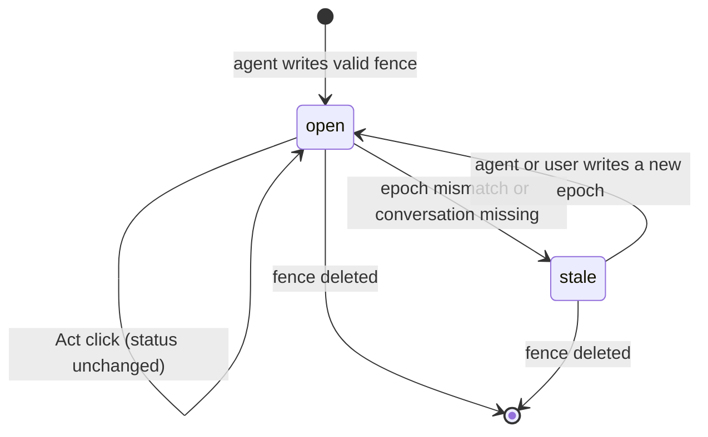
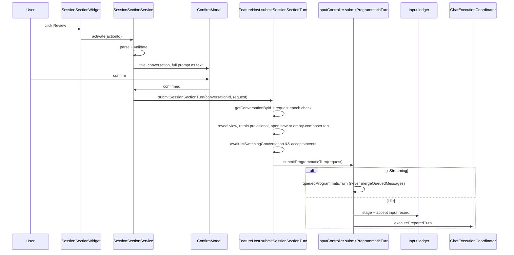

# Editor Session Sections

| Field | Value |
| --- | --- |
| **Product** | Dean |
| **Author** | Dean contributors |
| **Date** | 2026-08-17 |
| **Status** | Draft |
| **Type** | Technical design |

---

## Overview

Dean can already ask the user a question in the chat sidebar (`AskUserQuestion`) and can already write vault notes through provider `Write` / `Edit` tools. It cannot yet leave a **durable, session-bound interactive section inside an Obsidian note** that the user fills in or clicks later.

This design adds **Editor Session Sections**: a markdown-native `dean-session` YAML fence as the source of truth. Obsidian's `registerMarkdownCodeBlockProcessor('dean-session')` is the Live Preview and Reading-view surface. Two first-class kinds:

1. **Collect** — a questionnaire / design-feedback form the agent writes into the relevant vault note. The user fills it by editing that file in the Obsidian editor. Answers live in the note; they are not a chat-send with a confirm modal.
2. **Act** — pre-prompted buttons (Review, Fix, Audit, Cleanup). A click confirms (full prompt), then injects a canned prompt plus section context into the bound conversation.

The feature is Dean-owned. It is not a provider tool, not an in-chat widget, and not a new Obsidian view. Authoring in v1 is the existing Write/Edit path plus a system-prompt appendix.

Clicks do **not** call today's `InputController.sendMessage`. They go through a new `FeatureHost.submitSessionSectionTurn` (the only feature-facing entry) which opens or focuses a **retained** tab without replacing an unrelated active conversation, then a new `InputController.submitProgrammaticTurn` that is specified against today's send/queue/switch guards. Provider-native transcripts stay read-only.

---

## Background & Motivation

### Current state

| Surface | What it is | Why it is not this feature |
| --- | --- | --- |
| `AskUserQuestion` (`src/core/tools/toolNames.ts`, `InlineAskUserQuestion`) | Blocking, live-turn, in-sidebar tool interaction via `ProviderInteractionPort.askUserQuestion` | Ephemeral. Resolves a provider tool call. Dies with the turn, tab close, or plugin reload. |
| Plan mode (`InlinePlanApproval` / `InlineExitPlanMode`) | Blocking in-chat gate for `ProviderPlanInteractionRequest` | Not persisted in a vault note. |
| `Conversation.currentNote` | Vault-relative linked-note path, rewritten on rename by `ConversationRepository` | Context only. No interactive section. |
| Inline edit (`src/features/inline-edit/`, `src/core/auxiliary/InlineEditService.ts`) | Auxiliary session + CodeMirror overlay | Separate process/session. Does not talk to the live chat conversation. |
| Provider `Write` / `Edit` | Agents already mutate vault files; `WriteEditRenderer` previews them in chat | Output is inert markdown. No click → session binding. |
| Composer context tray / `SelectionController` | Pushes current note and editor selection into the next turn | One-shot context, not a parked control surface. |

Users want two things those surfaces do not provide:

- A place to **think and mark up** (design feedback, a long questionnaire) in the note they already have open, not in a cramped sidebar card that disappears.
- A place to **come back later** and fire a canned action (Review / Fix / Audit) into the same conversation, even if the chat tab is closed.

### Pain points this solves

- Long questionnaires block the agent (`AskUserQuestion`) or get lost in chat history.
- Boilerplate follow-ups require retyping or hunting old prompts.
- Session context lives in Dean metadata (`.dean/sessions/{id}.meta.json`) while the user's work lives in notes. There is no durable bridge the user can see and edit.

---

## Goals & Non-Goals

### Goals

- Persist interactive, session-bound sections in vault markdown so they survive reload, git, and opening the note without Dean focused.
- Support **Collect** (in-note questionnaire) and **Act** (click a pre-prompted button) as first-class kinds.
- Bind each section to a Dean `Conversation.id`, not to a runtime tab.
- Route **Act** clicks through a **new** programmatic-turn path that still produces an input-ledger record and a chat user message. Collect answers stay in the note until a later turn Reads that file, or until the user clicks a co-located Act button.
- Work for every provider that can write vault files. Do not require a new provider capability in v1.
- Fail closed on stale, spoofed, deleted, or malformed sections.
- Degrade to readable YAML in Source mode and when the code-block processor does not run.

### Non-Goals

- Replacing `AskUserQuestion` or plan-mode gates.
- Blocking a live provider turn on an editor questionnaire.
- A new Obsidian item view / modal as the primary surface.
- Mutating or deleting provider-native transcripts.
- Auto-running buttons, silent send, or scheduled execution.
- A Dean-owned MCP or host-injected tool. Dean does not inject host MCP servers today; authoring stays Write/Edit.
- Provider parity for anything beyond "can write a markdown file."
- Cross-vault or out-of-vault section files.
- Collaborative multi-user editing of a section.
- Rendering or executing other plugins' button formats (`button`, Meta Bind, Templater).
- A CodeMirror `Decoration.replace` fence scanner in v1.

---

## Key Decisions

| # | Decision | Rationale |
| --- | --- | --- |
| D1 | **Markdown fence is the source of truth**; Live Preview / Reading view project it. | Survives reload and git; readable without the plugin; Source mode still works. A CodeMirror-only widget would need a parallel store and would desync from the note. |
| D2 | **Fence language `dean-session`, body is YAML**, parsed with Obsidian `parseYaml` / `stringifyYaml` (same as `AgentSkillCodec`). | Matches Obsidian literacy; no new YAML dependency; reserved language avoids colliding with community `button` / `meta-bind` fences. |
| D3 | **Any vault markdown file may host a section.** Prefer `Conversation.currentNote` when set. No dedicated `.dean/` artifact note in v1. | The product request is "in the editor" so the user can mark up a real note. Binding is by `conversationId`, not by path. |
| D4 | **Dean-owned feature** (`src/core/session-sections/` + `src/features/session-sections/`). Not a provider tool, not under `src/providers/*`. | Editor widgets are an Obsidian surface. Feature code must not import providers or `src/main.ts`. Core must not import features. |
| D5 | **v1 authoring = Write/Edit + system-prompt appendix.** Validation is Dean-owned at parse time. No native tool. No MCP PR. | Dean has no cross-provider custom-tool injector and no host-MCP injection point. Claude MCP is CLI-owned; Grok/OpenCode pass `mcpServers: []`. |
| D6 | **No `ProviderCapabilities` flag in v1.** User setting `enableEditorSessionSections` gates the feature. | File write is not a capability. Providers that cannot write simply cannot author. |
| D7 | **Collect never blocks a live turn.** `AskUserQuestion` stays the blocking in-chat tool. | Editor I/O cannot be on the `ProviderInteractionPort` critical path. |
| D8 | **Collect is an in-note form, not a chat-send.** The user fills and saves the note. No Collect confirm modal. No turn on every keystroke. | The user chose this over “always confirm Submit” and “skip confirm when answers are visible.” Filling the file *is* the submission surface. |
| D9 | **Always confirm Act clicks** (full prompt as plain text). **Never confirm Collect.** | Act prompts can social-engineer (“Fix”). Collect has no send of its own. `ConfirmModal.ts` is a single `<p>` and cannot host an 8 000-char Act prompt. |
| D10 | **`sectionEpoch` increments only after a successful rewind persist in `ConversationController.rewind`, both session strategies.** | Conversation id is stable across rewind. `preserve-provider-session` writes `{ resumeAtMessageId: undefined }` and still truncates history. Generic `ConversationRepository.update` on `resumeAtMessageId` is too broad (fork snapshots, missing-session restore). |
| D11 | **The only click entry is `FeatureHost.submitSessionSectionTurn`.** It retains provisional tabs. Reuse an unbound tab only when the composer is actually empty; otherwise open a new tab. | `TabManager.openConversation` defaults to `preferNewTab: false` and replaces the active tab. `switchToImmediately` clears the textarea and `queuedMessage`. A `/new` tab has `conversationId === null` while the user may already have typed. Dual-pane previews are `provisional` until `commitProvisionalTab`. |
| D12 | **`InputController.submitProgrammaticTurn` is new work.** It must not call today's `sendMessage`. | Streaming ignores `turnRequestOverride`, always `mergeQueuedMessages`, and `buildTurnSubmission` captures live composer context. Silent returns when `canStartTurn === false` or `isSwitchingConversation`. |
| D13 | **User may edit or delete the fence. What they click (Act) is the current note text.** Collect answers live in the fence; they enter the ledger only if a co-located Act turn sends them. | The note is user-owned. Ledger records Act sends, not every Collect keystroke. |
| D17 | **No silent epoch restamp.** After rewind, old fences fail closed until the agent or user writes a new `epoch`. | Background vault mutation would surprise the user and fight Write/Edit. |
| D18 | **Act clicks inherit the conversation’s current permission mode.** | Same as composer send. A per-action read-only Review policy is not in v1. |
| D19 | **No session-manager list of sections in v1.** | Needs a rebuildable index. Defer. |
| D20 | **“I’m done filling this” is an Act button on the same fence, not a Collect Submit.** | Collect must not grow a second confirm. A co-located Act button uses the existing Act confirm + send path. |
| D14 | **Setting defaults to `false`**, decoded as a boolean in `DeanSettingsStorage`. Toggle off = inert fences. | `DeanSettings` has `[key: string]: unknown`. Spread-merge would accept `"yes"` / `1`. Dual-pane flags already use dedicated `normalizeEnable*` helpers. |
| D15 | **Live Preview and Reading view share `registerMarkdownCodeBlockProcessor`.** No CM fence-replacer in v1. | Dean has no processors today. `InlineEditModal` is a selection `StateField`, not a fence scanner. A second `Decoration.replace` would fight host LP widgets. |
| D16 | **Click must not rewrite durable `Conversation.currentNote`.** Host path is turn-scoped context only. | `ConversationController.save` always writes `fileCtx.getCurrentNotePath()`. `setCurrentNote` / `markCurrentNoteSent` as a click side effect would move the linked-note chip. |

### Resolved product questions

| Question | Decision | Rationale |
| --- | --- | --- |
| Collect Submit / confirm | In-note form. No Collect confirm modal. Answers persist in the file. Optional “I’m done” is a co-located **Act** button. | User override: submitting a questionnaire is editing the form in the relevant vault note. |
| Silent epoch restamp after rewind | No. Fail closed until agent or user writes a new epoch. | No background vault mutation. |
| Act permission mode | Inherit the conversation’s current permission mode. | Same as composer send. Not in v1: per-action read-only Review. |
| Session-manager list of sections | Defer. | Needs a rebuildable index. |

---

## Proposed Design

### What a section is

A **section** is one fenced code block:

````markdown
```dean-session
schemaVersion: 1
id: sec_01HZX4K2
conversationId: conv-1710000000000-ab12cd34e
epoch: 0
kind: act
title: Follow-ups
status: open
createdAt: 1710000100000
actions:
  - id: review
    label: Review
    prompt: |
      Review this note for consistency, broken wikilinks, and missing frontmatter.
  - id: fix
    label: Fix
    prompt: |
      Apply the smallest safe edits that fix the issues you already reported.
```
````

Collect example:

````markdown
```dean-session
schemaVersion: 1
id: sec_01HZX9QQ
conversationId: conv-1710000000000-ab12cd34e
epoch: 0
kind: collect
title: Design feedback
status: open
questions:
  - id: approach
    prompt: Which navigation model should we ship?
    type: single
    options:
      - id: tabs
        label: Tab bar
      - id: sessions
        label: Session manager only
  - id: notes
    prompt: Markup or comments
    type: markdown
answers:
  approach: tabs
  notes: ""
actions:
  - id: done
    label: I'm done
    prompt: |
      The user finished the questionnaire in this note. Read the
      dean-session Collect answers and continue from them.
```
````

A Collect fence may include `actions` (Act buttons). Those are Act clicks: they confirm the **Act prompt**, then send. They are not a Collect Submit modal.

**Not a section:** Obsidian callouts, frontmatter, HTML comments, or a CodeMirror widget with no markdown backing.

**Why a fence, not a callout.** Callouts are a poor schema host. Frontmatter is note-wide. A reserved fence gives a closed parse range and a language hook for `registerMarkdownCodeBlockProcessor`.

`conversationId` is any string that passes `isValidSessionMetadataId` (`SAFE_METADATA_ID_PATTERN`, plus rejection of `.` / `..` / `%2f` / `%5c`). `ConversationRepository.generateId` produces `conv-${Date.now()}-${random}`, but `create({ sessionId })` uses the provider session id as `Conversation.id`. Agents copying a provider UUID is allowed. Validation tests must not assume a `conv-` prefix.

### Where it lives

| Location | Allowed? | Notes |
| --- | --- | --- |
| `Conversation.currentNote` | Preferred | Prompt appendix tells the agent to write here when the linked note is set. |
| Any other vault `.md` file | Yes | Binding is `conversationId`, not path. |
| `.dean/sessions/…` artifact | No (v1) | Hidden from the user's editing loop. |
| Outside the vault | No | Processor only activates for a vault markdown file that exists. |

`PinnedLinkedNotePathCoordinator` and `ConversationRepository` rename rewrite stay on `currentNote` / pinned paths. They do **not** rewrite fence bodies. The fence does not store a note path; the host file is implicit.

A click that sends from `Notes/Dashboard.md` into a conversation linked to `Specs/RFC.md` must leave `Conversation.currentNote === 'Specs/RFC.md'`. The turn's `ExecutionInputContextSnapshot.currentNote.path` may be `Notes/Dashboard.md` so the agent can `Read` the host. Those are different fields.

### Architecture

```mermaid
flowchart TB
  subgraph vault [Vault note]
    Fence["```dean-session YAML```"]
  end

  subgraph core [src/core/session-sections]
    Codec[SessionSectionCodec]
    Validate[validateSessionSection]
    Types[SessionSection types]
    Prompt[sessionSectionPrompt appendix]
    TurnReq[SessionSectionTurnRequest]
  end

  subgraph feature [src/features/session-sections]
    Proc[SessionSectionCodeBlockProcessor]
    Widget[SessionSectionWidget]
    Confirm[SessionSectionConfirmModal]
    WriteBack[SessionSectionWriteBack]
    Svc[SessionSectionService]
  end

  subgraph host [FeatureHost — composition root]
    Submit[submitSessionSectionTurn]
  end

  subgraph chat [Chat pipeline — not imported by session-sections]
    Input[InputController.submitProgrammaticTurn]
    Ledger[ConversationInputLedgerStorage]
    Coord[ChatExecutionCoordinator]
    Prov[ProviderExecutionSession]
  end

  Fence --> Codec --> Validate --> Types
  Proc --> Codec
  Widget --> WriteBack
  Widget -->|Act click only| Svc
  Svc --> Confirm
  Svc --> Submit
  Submit --> Input
  Input --> Ledger
  Input --> Coord --> Prov
  Prompt --> SysPrompt[buildSystemPrompt appendices]
```

Layering follows `docs/architecture.md` and `scripts/check-architecture-boundaries.test.mjs`:

- `core/` owns schema, codec, validation, prompt appendix, context-tag formatters, and the `SessionSectionTurnRequest` DTO. It does not import features, `src/app/`, `src/main.ts`, or providers.
- `features/session-sections/` owns the processor, widget, Act confirm modal, Collect vault write-back, and Act click UX. It calls `FeatureHost.submitSessionSectionTurn` only for **Act**. It must not import `InputController`, `TabManager`, `DeanPlugin`, or `src/app/`.
- `src/main.ts` (composition root) implements `FeatureHost.submitSessionSectionTurn` by activating a view, retaining/opening a tab, waiting for switch to settle, then calling that tab's `InputController.submitProgrammaticTurn`.
- `features/chat/` gains `submitProgrammaticTurn` and a distinct `queuedProgrammaticTurn` slot. That API is not part of the session-sections import graph.
- Providers keep writing files with `Write` / `Edit`. They learn the schema through `buildSystemPrompt` appendices.

Thin scoped `AGENTS.md` files belong in `src/core/session-sections/` and `src/features/session-sections/` in the first implementation PR. They state local ownership only (codec is the only mutator of the parsed schema; vault write-back lives in the feature). Do not duplicate repo-wide rules.

### Lifecycle



`status` in the fence is advisory UI state (`open` / `stale`). Collect filling does not transition to `submitted` and does not send a turn. Authorization for **Act** uses `conversationId` + `epoch` + `getConversationById` at click time. Do not call `handleMissingProviderSession` (that API can delete or reset a conversation). Dean never silently restamps `epoch` after rewind.

### Session binding

Each section stores:

```ts
conversationId: string; // any isValidSessionMetadataId, not only conv-*
epoch: number;          // copied from Conversation.sectionEpoch at authoring time
```

| Event | Section behavior |
| --- | --- |
| Note renamed / moved | Fence moves with the file. `Conversation.currentNote` is rewritten by `ConversationRepository` independently. Binding unchanged. |
| Note deleted | Section gone. No Dean cleanup required. |
| Conversation archived | Still clickable. Confirm modal mentions archived. |
| Conversation deleted | After resolve (below), `getConversationById` is still null. Click fails closed as `conversation-missing`. Do not create a replacement. Do not call `handleMissingProviderSession`. |
| Tab closed | Conversation remains. `submitSessionSectionTurn` opens a retained tab. |
| Fork | New `Conversation.id`, `sectionEpoch` starts at `0`. Old sections stay bound to the source. Do not copy fences. |
| Rewind | After **successful** rewind persist (both `preserve-provider-session` and resume-at strategies), `ConversationController` increments `sectionEpoch` in that same save. Mismatch → stale, no send. Failed / cancelled rewind returns before `save` and must not bump. |
| Plugin reload | Fences still in the note. Processor re-applies. No in-memory registry. |

`sectionEpoch` is a new optional field on `Conversation` and `SessionMetadata` (`src/core/types/chat.ts`).

**Increment hook (exact).** Today `ConversationController.rewind` (`src/features/chat/controllers/ConversationController.ts`) truncates UI history, then:

```ts
await this.save(
  true,
  result.sessionStrategy === 'preserve-provider-session'
    ? { resumeAtMessageId: undefined }
    : {
      resumeAtMessageId: prevAssistantUuid,
      resetProviderSession: !prevAssistantUuid,
    },
);
```

If `save` throws, rewind returns without a success Notice. Extend `SaveOptions` with `incrementSectionEpoch?: boolean`. The rewind success path passes `incrementSectionEpoch: true` on **both** strategy objects. `save` then includes:

```ts
if (options?.incrementSectionEpoch) {
  const current = plugin.getConversationSync(state.currentConversationId!);
  updates.sectionEpoch = decodeSectionEpoch(current?.sectionEpoch) + 1;
}
```

Do **not** increment inside `ConversationRepository.update` when `'resumeAtMessageId' in safeUpdates`. That path also runs for missing-session restore, fork-related snapshots, and clearing the field.

**Persist / decode.** `toSessionMetadata` is an explicit object (not a spread). It must emit `sectionEpoch`. `DeanPlugin.createConversationMetadataShell` is the only metadata → `Conversation` constructor and must assign `sectionEpoch: decodeSectionEpoch(meta.sectionEpoch)`. `SessionStorage.readMetadata` spreads leftover JSON; a string `"yes"` must not survive as an epoch. Decode is fail-closed:

```ts
function decodeSectionEpoch(value: unknown): number {
  return typeof value === 'number'
    && Number.isInteger(value)
    && Number.isFinite(value)
    && value >= 0
    ? value
    : 0;
}
```

Missing → `0`. Forked conversations are `create()`d with a new id and no `sectionEpoch` (0).

**How the agent learns `conversationId` and `epoch`.** The appendix is static (schema + rules). Every user turn — composer **and** programmatic — must carry a binding tag when the flag is on.

`InputController.createExecutionSubmission` is the single place that copies composer context today (`currentNote` / editor / browser / canvas / external paths). It must also set:

```ts
context.conversationBinding = {
  conversationId: state.currentConversationId,
  sectionEpoch: decodeSectionEpoch(conversation.sectionEpoch),
};
```

when the flag is on and `state.currentConversationId` is set. Provider encoders then append it via a shared `appendProviderExecutionContext` helper. If this is omitted, agents invent or drop `epoch`; after the first rewind, omitted epoch (`0`) fail-closes almost every fence.

### Interaction kinds

#### Collect

Collect is an **in-note form**, not a chat-send.

1. The agent writes a `kind: collect` fence into the relevant vault file (prefer `Conversation.currentNote` / the note already under discussion).
2. The user fills the questionnaire by editing that file in the Obsidian editor. Live Preview / Reading view render the form from the fence. Source mode edits the YAML `answers` map directly.
3. Widget holds answers in memory. **One write-back owner** (`SessionSectionWriteBack`) flushes the fence `answers` map via `MarkdownPostProcessorContext.getSectionInfo` + `vault.modify` (or an editor transaction covering that line range if the leaf has an `Editor`). Reading view has no `EditorView`; CM transactions are not the owner.
4. Flush on blur and widget destroy. Not on every keystroke (a vault write remounts the processor widget). Saving the note (Obsidian autosave / explicit save) persists the same fence.
5. **There is no Collect confirm modal and no Collect Submit turn.** Filling and saving the note *is* the submission surface. Collect does **not** call `FeatureHost.submitSessionSectionTurn`. Collect does **not** start a provider turn on keystroke, blur, or save.
6. How answers reach the agent: they live in the note. The next composer or Act turn that includes that file as `currentNote` / file context can `Read` the fence. To push “I’m done” into chat immediately, put an **Act** button on the same fence (see example). That button uses the Act confirm + send path — it is not a Collect-only confirm.

If Collect ships before a dedicated multi-leaf digest, document last-writer-wins and no cross-leaf debounce. Unflushed in-memory answers are dropped when another writer reloads the file.

#### Act

1. User clicks a button.
2. `SessionSectionConfirmModal` shows conversation title, archived/stale badges, note path, action label, and the **full current prompt** in a scrollable `<pre>` / `createEl` text node. Do **not** markdown-render the prompt (markdown can hide instructions). Do **not** call `confirm()` in `src/shared/modals/ConfirmModal.ts`.
3. Confirm → `FeatureHost.submitSessionSectionTurn`. Cancel → no-op.
4. Fence `status` stays `open`. No `lastActivatedAt` write in v1.

Context included in the sent turn:

- Action prompt (canonical user text).
- `<session_section>` XML: `id`, `kind`, `actionId` or answers, `path` (host note), `title`.
- Live composer selection / browser / canvas context is **not** mixed in.
- Turn-scoped `ExecutionInputContextSnapshot.currentNote.path` = host note. Durable `Conversation.currentNote` is unchanged.



### Relationship to AskUserQuestion

| | In-chat `AskUserQuestion` | Editor session section |
| --- | --- | --- |
| Lifetime | Live turn | Durable in the note |
| Blocks provider tool call | Yes (`ProviderInteractionPort`) | Never |
| UI | `InlineAskUserQuestion` in the sidebar | Code-block processor widget |
| When to use | Turn cannot continue without the answer | User should think, mark up, or act later |
| Failure if note closed | N/A (in chat) | Section waits; no hung tool call |
| Provider contract | Existing tool | None in v1 |

Prompt appendix states this split. Dean must not route `ProviderQuestionInteractionRequest` into the editor.

### Authoring

**v1:** the agent uses provider `Write` or `Edit` to insert or update a `dean-session` fence. Dean does not intercept those tools. After the file lands, the processor parses it.

**Validation owner:** `validateSessionSection` in core. Invalid YAML, unknown `kind`, bad ids, missing `conversationId`, over-limit payloads, or disallowed execution-like fields (`onClick`, `shell`, `command`, `href`) fail the whole fence. No buttons on invalid fences.

**Who may update:** user (Source mode or Collect write-back) and agent (Write/Edit). Last writer wins at the file level. Collect answers are in the fence. They appear in the input ledger only if a co-located Act turn sends them.

**Removal:** delete the fence. No tombstone.

**Stamping epoch.** Agents copy `section_epoch` from `<dean_conversation>`. Omitted epoch parses as `0`. Dean does **not** auto-rewrite notes to inject or restamp epoch after rewind (D17). Old fences fail closed until the agent or user writes a new epoch.

**MCP is out of the v1 plan.** `@modelcontextprotocol/sdk` is in `package.json`, but Dean does not inject host MCP servers. Claude MCP is CLI-owned (`onload` even deletes leftover `.claude/mcp.json`). Grok and OpenCode ACP sessions pass `mcpServers: []`. Codex/Grok/OpenCode settings tell users to configure MCP on the provider CLI. There is no adapter to hang a shared Dean MCP server on. Do not schedule it as a small optional PR.

### Provider neutrality

v1 does **not** add `supportsEditorSessionSections` to `ProviderCapabilities`.

| Provider | Writes vault files today | `buildSystemPrompt` call site | Appendix merge |
| --- | --- | --- | --- |
| Claude | Yes | `ClaudeExecutionRequestEncoder` — `buildSystemPrompt({ mediaFolder, customPrompt, vaultPath, userName })` with **no** `options` today | Pass `{ appendices: buildDeanSystemPromptAppendices(settings, request.toolPolicy) }`. Skip when `systemInstructions.kind === 'explicit'`. |
| Codex | Yes | `CodexExecutionSession.resolveBaseInstructions` — `buildSystemPrompt(this.getSystemPromptSettings())` | Same `appendices`. Already special-cases `toolPolicy.kind === 'passive'` with `PASSIVE_INSTRUCTIONS`; still suppress the authoring appendix for `passive` / `read-only`. |
| Grok | Yes | `buildGrokSystemPrompt` → `buildSystemPrompt(settings, GROK_PROMPT_OPTIONS)` | **Merge**, do not replace: `{ ...GROK_PROMPT_OPTIONS, appendices }`. `GROK_PROMPT_OPTIONS` is frozen `{ toolGuidanceProfile: 'provider-native' }`. `computeGrokSystemPromptKey` must use the same merged options. |
| OpenCode | Yes | `prepareOpencodeLaunchArtifacts` — `buildSystemPrompt(requireSettings(params))` and `computeSystemPromptKey(requireSettings(params))` | Pass the same `appendices` into both calls. Launch-time; no per-request `toolPolicy`. Chat launches are not passive. |
| Pi | Yes | `resolveSystemPrompt` — `buildSystemPrompt({...}, { toolGuidanceProfile: 'provider-native' })` | Merge `appendices` into that options object. |

`computeSystemPromptKey` already hashes `options.appendices`. Every call site that computes a restart/cache key must pass the same appendix array as `buildSystemPrompt`, or toggling the flag will not restart sessions.

**Suppress the authoring appendix** when `toolPolicy` is `passive` or `read-only` (inline edit, title generation, and any chat turn that uses those policies). Those sessions cannot create fences; telling them to write `dean-session` blocks is waste. Act clicks on existing fences still work — they are user turns with `toolPolicy: { kind: 'provider-default' }` and inherit the conversation’s current permission mode (D18).

### Rendering surfaces

| Surface | Behavior |
| --- | --- |
| **Live Preview** | `registerMarkdownCodeBlockProcessor('dean-session', …)` only. Obsidian already turns fenced blocks into host widgets and typically runs registered processors there. **No** Dean `ViewPlugin` / `Decoration.replace` in v1. |
| **Reading view** | Same processor. |
| **Source mode** | Processor does not run. Fence stays editable YAML. Optional later gutter is out of v1. Buttons are not clickable in raw source. |
| **Mobile** | Same processor. If it does not run, YAML remains. |
| **Invalid fence** | Error callout. No buttons. |
| **Feature flag off** | Processor returns without creating widgets. After a settings change, refresh open markdown previews (see Rollout). |

**`registerMarkdownCodeBlockProcessor` is global.** Dean has no processors today. `MessageRenderer` calls `prepareDisplayOnlyCodeFences` so chat `MarkdownRenderer.render` cannot dispatch registered processors. `renderInlineEditMarkdownPreview` (`src/features/inline-edit/ui/inlineEditMarkdownPreview.ts`) does **not** remap; it passes the note `sourcePath` through. Without remapping, a `dean-session` fence inside an inline-edit preview would instantiate a live clickable widget.

Required processor gates (all of them):

1. `enableEditorSessionSections === true` (live settings read).
2. `ctx.sourcePath` is a vault-relative `.md` file that exists (`app.vault.getAbstractFileByPath`).
3. `el` is **not** inside a Dean-owned container (`.dean-view`, `.dean-inline-edit`, chat message roots).
4. Empty `sourcePath` (MessageRenderer uses `''`) never hosts a widget.

Required remap sites:

- Chat: already remaps every fence via `prepareDisplayOnlyCodeFences`. Keep that.
- Inline-edit preview: must call the same helper (or a narrower `remapDeanSessionFences`) **before** `MarkdownRenderer.render`.
- Any future `MarkdownRenderer.render` site: remap or be an allowed host.

**Do not cite `InlineEditModal` as a fence-scanner.** That file uses a `StateField` plus `Decoration.widget`, and `Decoration.replace({})` only to hide the original selection in diff mode. Fence walking, if needed later, belongs with `src/utils/markdownSegments.ts` / `DisplayOnlyCodeFences`. A CM replacer is follow-up work only if a prototype shows the processor does not run in Live Preview on the Obsidian version Dean targets.

Widget CSS lives in `src/style/features/session-sections.css`, registered in `src/style/index.css`. Classes: `.dean-session-section`, `.dean-session-section-title`, `.dean-session-section-actions`, `.dean-session-section-action`, `.dean-session-section--stale`, `.dean-session-section--invalid`. Follow `src/style/AGENTS.md` button/input rules.

Question bodies and titles may render through `MarkdownRenderer.render` after `escapeRawHtmlTags`. Labels, answers chrome, and the confirm-modal prompt are `createEl` text, never `innerHTML`.

### Editability

| Action | Allowed |
| --- | --- |
| User edits labels, prompts, questions, answers in Source mode | Yes. Next click uses the current text. |
| User deletes the fence | Yes. |
| User adds a new action in YAML | Yes, if the result validates. |
| Widget edits Collect answers | Yes, via `SessionSectionWriteBack` (section range), not a CM-only transaction. Writes the note only. No chat turn. |
| Widget edits Act prompts | No in v1. Prompts stay YAML-only so the Act confirm modal is the review step. |
| Agent rewrites a Collect the user has answered | Yes. Previous answers are whatever is now in the file. |
| Agent changes `conversationId` | Click routes to the new id if it exists, else fail closed. Confirm shows the resolved title. |

Collect write-back details:

- Resolve the fence range with `MarkdownPostProcessorContext.getSectionInfo(el)` (`lineStart` / `lineEnd`).
- Replace that line range in the file through `vault.modify` (Reading view) or the Markdown view's editor if it is the same file and currently loaded.
- Reading and Live Preview share this writer.
- `WidgetType.eq` is only relevant if a later CM widget exists. Processor widgets remount after `vault.modify`; that is why we flush on blur/destroy rather than per keystroke.
- If two leaves have the same note open, last `vault.modify` wins. No cross-leaf debounce in the first Collect PR unless the multi-leaf digest lands in the same PR.

### Concurrency

| Situation | Behavior |
| --- | --- |
| User filling Collect while agent streams | Widget stays interactive. Writes go to the note only. No Collect turn is queued. |
| Two tabs bound to the same conversation | `findConversationAcrossViews` prefers the existing tab. Send goes through that tab. |
| Note open in multiple leaves | One processor widget per preview. Answers persist through the file after flush. |
| Agent Write during in-memory Collect edit | Vault reload wins. Unflushed answers drop. Flush-on-destroy still runs if the widget is torn down cleanly. |
| Click during rewind | `isRewinding` → Notice `t('chat.rewind.inProgress')`, no send. |
| Click while the only tab is switching | `submitSessionSectionTurn` waits for `!isSwitchingConversation`. `switchToImmediately` currently **clears `queuedMessage`**; never enqueue before that await. |
| Click while `acceptsIntents === false` | Wait until `intentAdmissionPauseDepth === 0`, then send. `acceptsIntents` is not "tab is warm"; cold tabs accept intents and execution is lazy via `ensureExecutionInitialized`. |
| Active tab is streaming a **different** conversation | Do not call `openConversation` with `preferNewTab: false` (`switchTo` no-ops while streaming). Open a new tab, or bind an unbound tab only if its composer is empty (no text, images, or queue). |

### Persistence and replay

**Source of truth for the widget:** the fence in the note.

**Source of truth for "what was sent":** Dean's input ledger (`.dean/sessions/{conversationId}.inputs.json`).

Each **Act** click is a normal accepted input record. Collect answer edits are **not** ledger records.

- `rawDisplayText` — short label, e.g. `Section: Review`.
- `canonicalText` — the prompt plus `<session_section>` XML.
- `context.sessionSection` — structured snapshot.
- `context.currentNote.path` — **host** note path (turn-scoped).
- `context.conversationBinding` — id + epoch.

`ChatMessage`:

- `displayContent` = short label (`MessageRenderer` already prefers `displayContent`).
- `content` / `executionInput.canonicalText` = full sent text.

Do not invent a new `ContentBlock` type in v1. Do not mutate provider transcripts.

---

## API / Interface Changes

### Core types — section schema

New files under `src/core/session-sections/`:

- `AGENTS.md`
- `SessionSection.ts` — types
- `SessionSectionCodec.ts` — parse / serialize
- `validateSessionSection.ts` — fail-closed decode
- `sessionSectionPrompt.ts` — static appendix
- `SessionSectionContext.ts` — `formatDeanConversationBinding` / `formatSessionSectionContext`
- `SessionSectionTurn.ts` — `SessionSectionTurnRequest` / result types used by `FeatureHost`
- `decodeSectionEpoch.ts`

```ts
export const SESSION_SECTION_SCHEMA_VERSION = 1 as const;
export const SESSION_SECTION_FENCE_LANGUAGE = 'dean-session' as const;

export type SessionSectionKind = 'act' | 'collect';
export type SessionSectionStatus = 'open' | 'stale';
export type SessionSectionQuestionType = 'single' | 'multi' | 'text' | 'markdown';

export interface SessionSectionAction {
  readonly id: string;
  readonly label: string;
  readonly prompt: string;
}

export interface SessionSectionQuestionOption {
  readonly id: string;
  readonly label: string;
}

export interface SessionSectionQuestion {
  readonly id: string;
  readonly prompt: string;
  readonly type: SessionSectionQuestionType;
  readonly options?: readonly SessionSectionQuestionOption[];
}

export type SessionSectionAnswers = Record<string, string | string[]>;

export interface SessionSection {
  readonly schemaVersion: typeof SESSION_SECTION_SCHEMA_VERSION;
  readonly id: string;
  readonly conversationId: string;
  readonly epoch: number;
  readonly kind: SessionSectionKind;
  readonly title: string;
  readonly status: SessionSectionStatus;
  readonly createdAt: number;
  readonly actions: readonly SessionSectionAction[];
  readonly questions: readonly SessionSectionQuestion[];
  readonly answers: SessionSectionAnswers;
}

export interface SessionSectionTurnRequest {
  readonly displayContent: string;
  readonly canonicalText: string;
  readonly sessionSection: ExecutionInputSessionSectionSnapshot;
  readonly hostNotePath: string;
  /** Fence epoch from the current parse. Required so the host can fail-closed. */
  readonly epoch: number;
}

export type SessionSectionTurnResult =
  | { readonly status: 'sent' }
  | { readonly status: 'queued' }
  | { readonly status: 'blocked'; readonly reason: SessionSectionTurnBlockReason };

export type SessionSectionTurnBlockReason =
  | 'flag-off'
  | 'conversation-missing'
  | 'epoch-mismatch'
  | 'view-unavailable'
  | 'tab-not-ready'
  | 'rewind-in-progress'
  | 'invalid-request';
```

Limits (enforced by `validateSessionSection`, fail closed):

| Limit | Value |
| --- | --- |
| Fence body | 64 KiB |
| Title | 120 chars |
| Actions per section | 8 |
| Questions per section | 20 |
| Options per question | 12 |
| Action / option label | 80 chars |
| Action prompt | 8 000 chars |
| Text / markdown answer | 8 000 chars |
| Sections parsed per note | 16 (extras ignored + warning banner) |
| `id` / action / question ids | `^[A-Za-z0-9][A-Za-z0-9._-]{0,63}$` |
| `conversationId` | `isValidSessionMetadataId` — any legal session id, not only `conv-*` |

### Conversation + settings

```ts
// Conversation + SessionMetadata (src/core/types/chat.ts)
sectionEpoch?: number; // decodeSectionEpoch; default 0

// DeanSettings (src/core/types/settings.ts)
enableEditorSessionSections: boolean; // default false
```

`DeanSettingsStorage.load` must decode the flag the same way as dual-pane:

```ts
function normalizeEnableEditorSessionSections(value: unknown): boolean {
  return typeof value === 'boolean' ? value : false;
}
```

Missing, `"yes"`, `1`, and `null` are `false`. Copy the dual-pane pattern in `DeanSettingsStorage.load` **exactly**:

1. `const enableEditorSessionSections = normalizeEnableEditorSessionSections(stored.enableEditorSessionSections);`
2. Put that boolean on `legacyNormalized` **before** `merged = { ...this.getDefaults(), ...legacyNormalized }`.
3. Optionally also assign `merged.enableEditorSessionSections` after the spread as belt-and-suspenders.
4. Persist when `'enableEditorSessionSections' in stored` and the stored value was not a boolean (same idea as `shouldPersistDualPaneNormalization`).

Mutating `legacyNormalized` **after** `merged` is built does not change `merged`. `storedWithoutLegacy` still carries a raw `"yes"` / `1`; that value wins the spread unless the normalized boolean is already on the object being spread.

`DEFAULT_DEAN_SETTINGS.enableEditorSessionSections = false`.

### Execution context

Keep `ExecutionInputSnapshot.schemaVersion` at `1`. Add optional fields:

```ts
export interface ExecutionInputSessionSectionSnapshot {
  sectionId: string;
  notePath: string;
  conversationId: string;
  kind: 'act' | 'collect';
  actionId?: string;
  title?: string;
  prompt?: string;
  answers?: SessionSectionAnswers;
}

export interface ExecutionInputConversationBindingSnapshot {
  conversationId: string;
  sectionEpoch: number;
}

export interface ExecutionInputContextSnapshot {
  currentNote?: ExecutionInputCurrentNoteSnapshot;
  editorSelection?: ExecutionInputEditorSnapshot | null;
  browserSelection?: ExecutionInputBrowserSnapshot | null;
  canvasSelection?: ExecutionInputCanvasSnapshot | null;
  conversationBinding?: ExecutionInputConversationBindingSnapshot;
  sessionSection?: ExecutionInputSessionSectionSnapshot;
}
```

Mirror `conversationBinding` and `sessionSection` on `ProviderExecutionContext`.

`ChatTurnRequest` (`src/features/chat/state/types.ts`) gains optional `sessionSection`. It does **not** grow live selection fields for programmatic turns.

**`createExecutionSubmission` (all turns)** when the flag is on and `state.currentConversationId` is set:

1. Copy existing context fields from the `ChatTurnRequest` (unchanged).
2. Set `context.conversationBinding` from the bound conversation's id and decoded `sectionEpoch`.
3. If `request.sessionSection` is present, set `context.sessionSection`.

Composer sends therefore carry `<dean_conversation>` without a `<session_section>`. Programmatic sends carry both.

Shared append helper, used by all five encoders that currently copy the same four `append*` calls:

```ts
export function appendProviderExecutionContext(
  prompt: string,
  context: ProviderExecutionContext | undefined,
): string;
```

Order: current note → editor → browser → canvas → `dean_conversation` → `session_section`.

Call sites to switch:

- `src/providers/claude/execution/ClaudeExecutionRequestEncoder.ts` (`encodePrompt`)
- `src/providers/codex/execution/CodexExecutionSession.ts`
- `src/providers/grok/execution/GrokExecutionSession.ts`
- `src/providers/opencode/runtime/buildOpencodePrompt.ts`
- `src/providers/pi/execution/PiExecutionSession.ts` (`encodePrompt`)

Strip helpers that must learn the new tags (not only `XML_CONTEXT_PATTERN`):

- `XML_CONTEXT_PATTERN` in `src/utils/context.ts`
- `extractUserQuery` fallback regexes in the same file (hardcoded `linked_note` / `current_note` / `editor_*` / `context_files` / `canvas_selection` / `browser_selection`)
- Any test fixtures that assert stripped display text

If `extractUserQuery` is left unchanged, history dedup (`src/utils/session.ts`) and OpenCode/Pi history stores will leak XML into visible queries.

Prompt XML:

```xml
<dean_conversation id="conv-…" section_epoch="0" />

<session_section id="sec_…" kind="act" action="review" path="notes/spec.md" title="Follow-ups">
<![CDATA[Review this note for consistency…]]>
</session_section>
```

`src/core/prompt/mainAgent.ts` documents both tags next to `<linked_note>`. Treat bodies as untrusted user content.

### FeatureHost — the only click entry

Do **not** add `ensureConversationOpen` or `activateChatView` as feature-facing APIs. Do **not** expose `TabManager.openConversation` on `FeatureTabManagerHost` just so `session-sections` can drive tabs. Do **not** pass `DeanPlugin` into the processor.

```ts
// src/features/FeatureHost.ts
submitSessionSectionTurn(
  conversationId: string,
  request: SessionSectionTurnRequest,
): Promise<SessionSectionTurnResult>;
```

Implemented on `DeanPlugin` (structurally satisfies `FeatureHost`). Invariants, in order:

1. If `!settings.enableEditorSessionSections` → `{ status: 'blocked', reason: 'flag-off' }` plus Notice.
2. Resolve the conversation. **Never** call `handleMissingProviderSession` — that method asks the provider history service whether the native session is gone and may **delete or reset** a still-listed Dean conversation (`ConversationRepository.handleMissingProviderSession`). There is no FeatureHost deletion-marker reader; do not add one for this path.
   1. `const conversation = await this.getConversationById(conversationId)` (`getById` → `ensureHydrated` → `getSync`).
   2. If null, this may be deferred metadata (`loadSettings({ deferNonRestoredSessionMetadata: true })` only adopts the restored tab). On `DeanPlugin` (not a new FeatureHost API):
      - Targeted read via the existing `this.storage.sessions.load(id)` (same reader as `loadCurrentTabSessionMetadata`). That call already returns null for a deletion marker or a missing file.
      - If a record exists, `adoptMetadataConversations` that shell (composition-root / repository only) and `getConversationById` again.
      - If still null and `!hasLoadedAllSessionMetadata`, `startRemainingSessionMetadataLoad()`, `await remainingSessionMetadataLoad`, then `getConversationById` once more.
   3. Still null → `{ status: 'blocked', reason: 'conversation-missing' }` plus Notice. This covers deleted, never-existed, and not-yet-listed-after-retry. Never `createConversation`.
3. If `request.sessionSection.conversationId !== conversationId` or `decodeSectionEpoch(request.epoch) !== decodeSectionEpoch(conversation.sectionEpoch)` → `epoch-mismatch`. `epoch` is a required field on `SessionSectionTurnRequest` (not on the ledger snapshot). The feature must re-parse the fence immediately before building the request so a stale widget cannot pair an old `actionId` with a freshly typed epoch.
4. Reveal a Dean view using the existing private `ensureViewOpen()` / `activateView()` path. Failure → `view-unavailable`.
5. Resolve a tab:
   - If `findConversationAcrossViews` hits a tab: `revealWorkspaceLeaf`, `switchToTab`, **`commitProvisionalTab`**.
   - Else if the active view has a **reusable empty draft**: `conversationId === null` **and** `!tab.dom.inputEl.value.trim()` **and** `!tab.ui.imageContextManager.hasImages()` **and** `!tab.state.queuedMessage` **and** `!tab.state.queuedProgrammaticTurn`. Only then `conversationController.switchTo(conversationId)` and `commitProvisionalTab`. `/new` leaves `conversationId === null` while the user may already have typed; `switchToImmediately` would wipe that composer (`inputEl.value = ''`, `clearQueuedMessage()`).
   - Else `TabManager.openConversation(conversationId, { preferNewTab: true, activate: true, provisional: false })`. This may create a second tab while the user is composing a New Chat — that is the intended tradeoff. **Never** the default `preferNewTab: false`.
6. Await until that tab's `state.isSwitchingConversation === false` and `session.acceptsIntents`. Do not submit or enqueue until this await completes. Timeout → `tab-not-ready` plus Notice.
7. If `state.isRewinding` → `rewind-in-progress`.
8. Call `tab.controllers.inputController.submitProgrammaticTurn(request)`. Map thrown/blocked outcomes to the result union. Surface a Notice on every `blocked` reason (no silent no-op).

`session-sections` never sees `AssembledTabRuntime`.

### InputController.submitProgrammaticTurn — new work

Today's public entry is `sendMessage(options?: SendMessageOptions)`. It cannot host this feature unchanged:

| Today's behavior | Why a wrapper fails |
| --- | --- |
| `if (canStartTurn?.() === false) return;` | Silent drop. |
| `isCreatingConversation \|\| isSwitchingConversation` → return | `submitSessionSectionTurn` races `switchToImmediately`. |
| Streaming branch always `buildTurnSubmission({ content, images, editorContextOverride })` | Ignores `turnRequestOverride`. Captures live selection and `FileContextManager.getCurrentNotePath()`. |
| Streaming always `mergeQueuedMessages` | `mergeQueuedChatTurns` concatenates `displayContent` and `request.text` with `\n\n`. |
| Non-streaming path calls `fileContextManager.startSession()` and `markCurrentNoteSent()` | Session-lock + "note already sent" side effects. Does not by itself rewrite `Conversation.currentNote`, but combining it with `setCurrentNote(host)` would. |
| `switchToImmediately` calls `clearQueuedMessage()` | A queue written before switch completes is deleted. |

Specify a **new** method that does not call `sendMessage`:

```ts
async submitProgrammaticTurn(request: SessionSectionTurnRequest): Promise<SessionSectionTurnResult>
```

Invariants:

1. Build a complete `ChatTurnRequest` from the request only: `text = canonicalText`, `currentNotePath = hostNotePath`, `sessionSection = request.sessionSection`, **no** `editorSelection` / `browserSelection` / `canvasSelection`, **no** `FileContextManager.getCurrentNotePath()`, **no** composer images.
2. Do not read or clear the composer textarea. Do not call `buildTurnSubmission`.
3. Do not call `fileCtx.setCurrentNote`, `startSession`, or `markCurrentNoteSent`.
4. `userMsg.displayContent = request.displayContent`; `userMsg.content = request.canonicalText` (set before execute, not the current "both = displayContent, then overwrite content later" dance alone).
5. If `isStreaming`: assign `state.queuedProgrammaticTurn` (new `ChatState` field). Never `mergeQueuedMessages` with `state.queuedMessage`. If a programmatic turn is already queued, replace it (last click wins) or block — pick replace and Notice. Composer `queuedMessage` stays intact.
6. If `!acceptsIntents` / `isSwitchingConversation` / `isCreatingConversation`: return `tab-not-ready` (the host should have waited; this is the last fence).
7. If `isRewinding`: Notice + `rewind-in-progress`.
8. Idle path calls a new private `executePreparedTurn(displayContent, turnRequest)` extracted from the **non-streaming** half of `executeSendMessage` (lazy `ensureExecutionInitialized`, `createExecutionSubmission`, `coordinator.execute`). That extract must accept an option `touchFileContext: false`. Permission mode is whatever `createExecutionSubmission` already copies from the conversation/settings snapshot — inherit, do not override (D18).
9. `processQueuedMessage` / `resumeQueuedTurnAfterIntentAdmission`: after a stream ends, send `queuedProgrammaticTurn` first, then the composer `queuedMessage`. Programmatic dequeue calls `submitProgrammaticTurn` / `executePreparedTurn`, not `sendMessage({ turnRequestOverride })`.
10. `clearQueuedMessage` on conversation switch also clears `queuedProgrammaticTurn`.

Unit tests **before** the processor/widget PR: streaming queue isolation, composer text not concatenated, rewind-in-progress, switch-in-progress, `canStartTurn === false`, click does not change `FileContextManager.getCurrentNotePath()`, `createExecutionSubmission` attaches `conversationBinding` on a normal composer send.

### Composition (`src/main.ts`)

```ts
this.registerMarkdownCodeBlockProcessor(
  SESSION_SECTION_FENCE_LANGUAGE,
  (source, el, ctx) => {
    renderSessionSectionBlock(this /* as FeatureHost */, source, el, ctx);
  },
);
```

No `registerEditorExtension` in v1. Processor host type is `FeatureHost`, not `DeanPlugin`.

On `enableEditorSessionSections` change (`mutateSettings` / settings tab):

1. Iterate `workspace.getLeavesOfType('markdown')` and refresh preview (`leaf.view.previewMode?.rerender(true)` or the current Obsidian preview-rerender equivalent).
2. Live Preview leaves pick up the next editor update; force a preview refresh on those leaves as well so toggling off removes buttons without a plugin reload.

`buildDeanSystemPromptAppendices(settings, toolPolicy?)` is the only appendix factory. Provider call sites listed above must pass it.

---

## Data Model Changes

### Fence schema (vault)

YAML mapping, `schemaVersion: 1`. Serialize with `stringifyYaml`. Do not emit undefined keys.

### Dean conversation metadata

`sectionEpoch?: number` on `Conversation` and `SessionMetadata`.

| Seam | Required change |
| --- | --- |
| `ConversationRepository.toSessionMetadata` | Emit `sectionEpoch: decodeSectionEpoch(conversation.sectionEpoch)` |
| `DeanPlugin.createConversationMetadataShell` | Assign decoded `sectionEpoch` |
| `ConversationController.save` | Apply `incrementSectionEpoch` from rewind only |
| `ConversationRepository.update` | No auto-increment |
| `SessionStorage.readMetadata` | Do not treat leftover JSON as a trusted number; decode at the shell |

Migration: missing → `0`. No backfill job.

### Input ledger

No schema-version bump. New optional `sessionSection` / `conversationBinding` on `ExecutionInputContextSnapshot`.

### Settings

`enableEditorSessionSections: false` in defaults. Boolean decoder in `DeanSettingsStorage`. Readers treat invalid as false.

### No section index file

v1 does not write `.dean/session-sections.json`. A ComposerContextTray chip that needs "sections in the active note" must scan the active markdown view's current text (or skip the chip until an index exists). Do not invent a cache in the first UI PR.

---

## Alternatives Considered

### 1. Extend in-chat `AskUserQuestion` only

Reuse `InlineAskUserQuestion` / `ProviderInteractionPort.askUserQuestion`.

- **Pros:** Already built; blocking semantics are well fenced.
- **Cons:** Ephemeral; cannot host "click Review next Tuesday"; ties editor I/O to a live tool call.

**Rejected** as the primary design. Keep AUQ for blocking turns.

### 2. Plain markdown checklist with no interactivity

- **Pros:** Zero code.
- **Cons:** No session binding, no confirm, no structured answers.

**Rejected** as the feature; the fence remains readable as a fallback.

### 3. Dedicated Obsidian view / modal

- **Pros:** Full control of UI.
- **Cons:** Not "in the editor"; another leaf; persistence would reinvent notes.

**Rejected** as the primary surface.

### 4. Cursor / Claude-style artifact panel

- **Pros:** Polished; not mixed into user notes.
- **Cons:** Tab-scoped and ephemeral. Inline edit already covers "edit this selection now."

**Rejected** for this feature.

### 5. Community Buttons / Meta Bind / Templater

- **Pros:** Users may already know those plugins.
- **Cons:** Foreign schema; executing another plugin's prompt language is a security footgun.

**Rejected.** Reserved language `dean-session` only.

### 6. Frontmatter-driven Dataview-like blocks

- **Cons:** Frontmatter is note-global; Dataview is a third-party runtime.

**Rejected.**

### 7. CodeMirror-only widget + JSON in `.dean/`

- **Cons:** Invisible without Dean; desyncs from the note.

**Rejected** as source of truth.

### 8. New provider-native tool or Dean MCP server

- **Pros:** Structured authoring.
- **Cons:** No provider parity. Dean does not inject host MCP servers. Claude MCP is CLI-owned; ACP adapters pass `mcpServers: []`.

**Rejected for v1.** Revisit only after a specific adapter exposes a real host-MCP hook; that would be a provider-local follow-up, not a shared feature-owned server.

### 9. Wrap today's `sendMessage` for clicks

- **Cons:** Streaming ignores `turnRequestOverride`, merges queues, captures live context, and silently no-ops. Documented in D12.

**Rejected.**

---

## Security & Privacy Considerations

Threat model: the vault is user-controlled and **untrusted**. Agents write untrusted text. Other notes, plugins, and pasted content can spoof a `dean-session` fence.

| Threat | Severity | Mitigation |
| --- | --- | --- |
| Social-engineered **Fix** button whose prompt is destructive | High | Always confirm. Modal shows the **full prompt as plain text**, conversation title, and note path. No markdown render of the prompt. |
| Auto-execution / hover-send | High | User gesture required. Unknown execution fields fail the fence. |
| Prompt injection via note / Collect answers / Act prompt body | High | Act payload sent as user-turn text inside `<session_section>` CDATA. Collect answers stay in the note and are Read as untrusted file content. System prompt: treat both as untrusted user content. |
| Spoofed `conversationId` | Medium | Not an auth boundary — the click is. Confirm shows the resolved title. Missing / deleted id fails closed. Any `isValidSessionMetadataId` is syntactically legal. |
| Stale button after rewind / fork | High | Epoch mismatch after successful rewind persist (both strategies). Fork has a new id. |
| XSS in rendered markdown | High | `createEl` for chrome and confirm prompt; `escapeRawHtmlTags` before `MarkdownRenderer` for question bodies. |
| Processor widgets in chat / inline-edit | High | Remap fences on every Dean `MarkdownRenderer.render`. Processor refuses empty `sourcePath` and `.dean-` hosts. |
| Write / click outside the vault | High | Processor requires a vault `.md` file. Host only opens Dean conversations. |
| Click while conversation is gone | Medium | `getConversationById` still null after deferred-metadata retry / targeted `storage.sessions.load` → `conversation-missing`, no new conversation. Never `handleMissingProviderSession`. |
| Queue merge with a hostile composer draft | High | Distinct `queuedProgrammaticTurn`. Never `mergeQueuedMessages`. Never enqueue before `switchToImmediately` finishes (it clears `queuedMessage`). |
| Click rewrites the linked note to the dashboard file | High | Do not `setCurrentNote(host)`. Tests: click in `Notes/Dashboard.md` leaves `Conversation.currentNote` at `Specs/RFC.md`. |
| Agent stamps a future epoch | Low | Click fail-closes until rewind catches up. User can edit epoch in Source; confirm still shows the prompt. |
| Section in a shared / published note | Medium | Prompts are vault content. No extra network send beyond the user's provider. |

Fail-closed rules (must all pass before an **Act** send):

1. Feature flag on (decoded boolean).
2. Fence parses and validates.
3. `conversationId` is a valid session id and `getConversationById` returns a conversation after the deferred-metadata resolve above.
4. `decodeSectionEpoch(request.epoch) === decodeSectionEpoch(conversation.sectionEpoch)`.
5. User confirmed the **Act** prompt (full text). Collect answer edits never reach this list.
6. Target tab `acceptsIntents` and `!isSwitchingConversation` and `!isRewinding`.
7. Action ids exist in the **current** parse (no stale widget closures).

---

## Observability

Dean has no `console.*` in production and no SaaS metrics.

### User-visible

- `Notice` for every `SessionSectionTurnResult` `blocked` reason and for send failure.
- Widget banners for parse errors and stale state.
- Act confirm modal is the pre-send audit trail. Collect has no send modal.

Do **not** put this on `StatusPanel`.

### Debug ring buffer

`SessionSectionDiagnostics` in `src/features/session-sections/` — in-memory ring of 50 events (`parsed`, `invalid`, `activate_blocked`, `activate_confirmed`, `activate_sent`, `activate_queued`, `activate_failed`). No prompt bodies, no answers. Expose later via a diagnostics command (not required in the first processor PR).

### What we do not do

- No `console.log`.
- No writing diagnostics into the vault by default.
- No provider-side logging of section payloads.

---

## Rollout Plan

This is a local Obsidian plugin.

1. **Default off.** `enableEditorSessionSections: false`, boolean decoder.
2. **Settings → General → Editor session sections** toggle.
3. **Enable:** appendix + processor come online without reload (live settings read + markdown preview refresh).
4. **Disable:** processor no-ops **and** open markdown leaves refresh so existing widgets disappear. Leftover fences become ordinary code blocks. Input-ledger history remains.
5. **No staged cohort.** Ship Act after schema + send-contract PRs. If Act regresses, leave the flag off.
6. **i18n:** the first PR that adds `t()` keys must update **all ten** locale files. `tests/unit/i18n/locales.test.ts` requires every locale to have the same keys as `en.json`. English copy in the other nine files is acceptable; runtime fallback is not a test exemption.

Toggling the flag changes `computeSystemPromptKey` **only if** every provider key/call site passes `appendices`.

---

## Open Questions

1. **Does `registerMarkdownCodeBlockProcessor` run in Live Preview on the Obsidian version Dean targets?** Implementation spike only. If a prototype shows it does not, a CM decoration is new work (not `InlineEditModal` copy-paste). Do not schedule that in the first UI PR.

---

## References

- `AGENTS.md`, `src/app/AGENTS.md`, `src/core/AGENTS.md`, `src/features/chat/AGENTS.md`, `src/style/AGENTS.md`
- `docs/concepts.md`, `docs/features.md`, `docs/architecture.md`
- `src/core/types/tools.ts` — `AskUserQuestionItem`
- `src/core/execution/ProviderInteractionPort.ts`
- `src/core/execution/ProviderExecutionRequest.ts` — `ProviderExecutionContext`
- `src/core/types/chat.ts` — `Conversation`, `ExecutionInputSnapshot`
- `src/core/bootstrap/ConversationInputLedgerStorage.ts`
- `src/core/bootstrap/SessionStorage.ts` — `isValidSessionMetadataId`, leftover JSON spread in `readMetadata`
- `src/core/prompt/mainAgent.ts` — `buildSystemPrompt`, `appendices`, `computeSystemPromptKey`
- `src/features/FeatureHost.ts` — no `ensureConversationOpen` / `activateChatView` today
- `src/features/chat/controllers/InputController.ts` — `sendMessage`, streaming queue, `createExecutionSubmission`, `mergeQueuedChatTurns`
- `src/features/chat/controllers/ConversationController.ts` — `rewind` persist, `save` always writes `fileCtx` current note, `switchToImmediately` clears `queuedMessage`
- `src/features/chat/tabs/TabManager.ts` — `openConversation` defaults `preferNewTab: false`
- `src/features/chat/tabs/TabLifecycle.ts` — `commitProvisionalTab`
- `src/features/chat/tabs/TabSession.ts` — `acceptsIntents` is `intentAdmissionPauseDepth === 0`
- `src/features/inline-edit/ui/InlineEditModal.ts` — selection `StateField`, not a fence scanner
- `src/features/inline-edit/ui/inlineEditMarkdownPreview.ts` — `MarkdownRenderer.render` without fence remap
- `src/features/chat/rendering/DisplayOnlyCodeFences.ts` / `src/utils/markdownSegments.ts` — fence remap for chat
- `src/core/skills/AgentSkillCodec.ts` — `parseYaml` / `stringifyYaml`
- `src/utils/context.ts` — `<linked_note>`, `XML_CONTEXT_PATTERN`, `extractUserQuery`
- `src/utils/markdownHtml.ts`
- `src/app/conversations/ConversationRepository.ts` — `toSessionMetadata` explicit persist
- `src/main.ts` — `createConversationMetadataShell`, `activateView`, private `ensureViewOpen`
- `src/app/settings/DeanSettingsStorage.ts` — `normalizeEnableDualPane` pattern
- `src/shared/modals/ConfirmModal.ts` — single `<p>` confirm
- `tests/unit/i18n/locales.test.ts` — locale key parity
- `src/providers/grok/prompt/GrokSystemPrompt.ts` — frozen `GROK_PROMPT_OPTIONS`
- `scripts/check-architecture-boundaries.test.mjs`

---

## PR Plan

Each PR is independently reviewable and mergeable. Later PRs stay behind the same settings flag. MCP is not a PR.

### PR 1 — Schema, settings, epoch, prompt/context plumbing

**Title:** Add editor session-section schema and context plumbing

**Dependencies:** none

**Files / components:**

- `src/core/session-sections/*` including scoped `AGENTS.md`
- `src/core/types/chat.ts`, `src/core/types/settings.ts`, `src/core/types/index.ts`
- `src/core/execution/ProviderExecutionRequest.ts`
- `src/core/prompt/mainAgent.ts` + tests
- `src/utils/context.ts` — `appendProviderExecutionContext`, `XML_CONTEXT_PATTERN`, **`extractUserQuery` fallback strip list**
- Provider encoder call sites listed above + `GrokSystemPrompt` merge
- `src/app/settings/defaultSettings.ts`
- `src/app/settings/DeanSettingsStorage.ts` — boolean decoder
- `src/app/conversations/ConversationRepository.ts` — `toSessionMetadata` only (no increment in `update`)
- `src/main.ts` — `createConversationMetadataShell` decode
- `src/features/chat/controllers/ConversationController.ts` — rewind `incrementSectionEpoch` on both strategies
- `src/features/settings/DeanSettings.ts` — General toggle
- `src/i18n/locales/en.json` **and** the other nine locale files (English stubs allowed)
- Tests: codec, validate, `decodeSectionEpoch`, settings decoder, rewind success / cancel / preserve-session / fork epoch, encoder tag order and strip helpers, `createConversationMetadataShell`

**Description:** No editor UI. Flag default off. Composer turns still do not attach `conversationBinding` until PR 2 (`createExecutionSubmission` change lives with the send contract so it is testable against `InputController`). If that coupling is awkward, land the `createExecutionSubmission` binding attach in this PR with InputController unit tests and keep programmatic send for PR 2.

**Preferred split of the binding attach:** include `createExecutionSubmission` conversationBinding in **this** PR. It is the authoring prerequisite and is independent of programmatic send.

### PR 2 — FeatureHost submit contract + programmatic turn

**Title:** Add session-section programmatic send path

**Dependencies:** PR 1

**Files / components:**

- `src/features/FeatureHost.ts` — `submitSessionSectionTurn`
- `src/main.ts` — implementation (view reveal, retain provisional, empty-composer draft reuse, else `preferNewTab: true`)
- `src/features/chat/controllers/InputController.ts` — `submitProgrammaticTurn`, `executePreparedTurn`, no `sendMessage` wrap
- `src/features/chat/state/types.ts` + `ChatState.ts` — `queuedProgrammaticTurn`
- Tests: streaming isolation, composer merge refusal, switch-in-progress, rewind-in-progress, silent-guard Notices, click does not change durable `currentNote` / `FileContextManager.getCurrentNotePath()`, open path does not replace a busy unrelated tab, **does not bind a `/new` tab that has composer text/images/queue**, deferred `getConversationById` null then metadata-load retry succeeds, `handleMissingProviderSession` is never called, Act send inherits conversation permission mode

**Description:** No editor widget yet. Tests drive the host method directly.

### PR 3 — Act processor and confirm modal

**Title:** Render Act session sections in the editor

**Dependencies:** PR 1, PR 2

**Files / components:**

- `src/features/session-sections/` — processor, Act widget, confirm modal, service, diagnostics ring, scoped `AGENTS.md`
- `src/features/inline-edit/ui/inlineEditMarkdownPreview.ts` — remap `dean-session` fences
- `src/main.ts` — register processor with `FeatureHost`
- Settings-change markdown preview refresh
- `src/style/features/session-sections.css` + `src/style/index.css`
- Locale strings already present from PR 1; add any new keys to **all** locale files
- Tests: processor gating (vault path, empty sourcePath, Dean containers, flag off), confirm modal does not use `innerHTML`, toggle-off removes buttons after refresh

**Description:** Smallest user-visible slice. Collect fences parse and render questions read-only (no write-back yet) so agents can start writing them.

### PR 4 — Collect in-note form + write-back

**Title:** Add Collect session sections

**Dependencies:** PR 3

**Files / components:**

- Widget inputs (single / multi / text / markdown) that write the fence `answers` map
- `SessionSectionWriteBack` (section range via `getSectionInfo` + `vault.modify`)
- Flush on blur / destroy — **not** on every keystroke, **not** as a chat send
- No Collect confirm modal. No Collect `submitSessionSectionTurn`. Co-located Act buttons (PR 3) remain the only send control
- Multi-leaf last-writer-wins documented; include `lastWriteDigest` in **this** PR if the extra tests stay small, otherwise an explicit v1 limitation in the Collect widget header
- Tests: answers persist in the fence, multi-select, Reading-view write-back, no `submitSessionSectionTurn` on Collect edit/save, remount after flush does not lose flushed answers, “I’m done” Act button still confirms the Act prompt

**Description:** Collect is an in-note form. Filling and saving the note is the surface. Do not ship per-keystroke vault writes or a Collect send path.

### PR 5 — Chat projection

**Title:** Show session-section origin in chat history

**Dependencies:** PR 2

**Files / components:**

- `src/features/chat/rendering/MessageRenderer.ts` — chip from `executionInput.context.sessionSection`
- Do **not** add a ComposerContextTray "sections in this note" chip until a scan strategy exists (active-view text scan or a rebuildable index)
- Tests through MessageRenderer

**Description:** Ledger-backed history without opening the note.

### PR 6 — Remaining locale translations

**Title:** Translate editor session-section copy

**Dependencies:** first PR that added keys (PR 1)

**Files / components:** `src/i18n/locales/{zh-CN,zh-TW,ja,ko,de,fr,es,ru,pt}.json`

**Description:** Replace English stubs with real translations. Keys already exist so `locales.test.ts` stays green.
